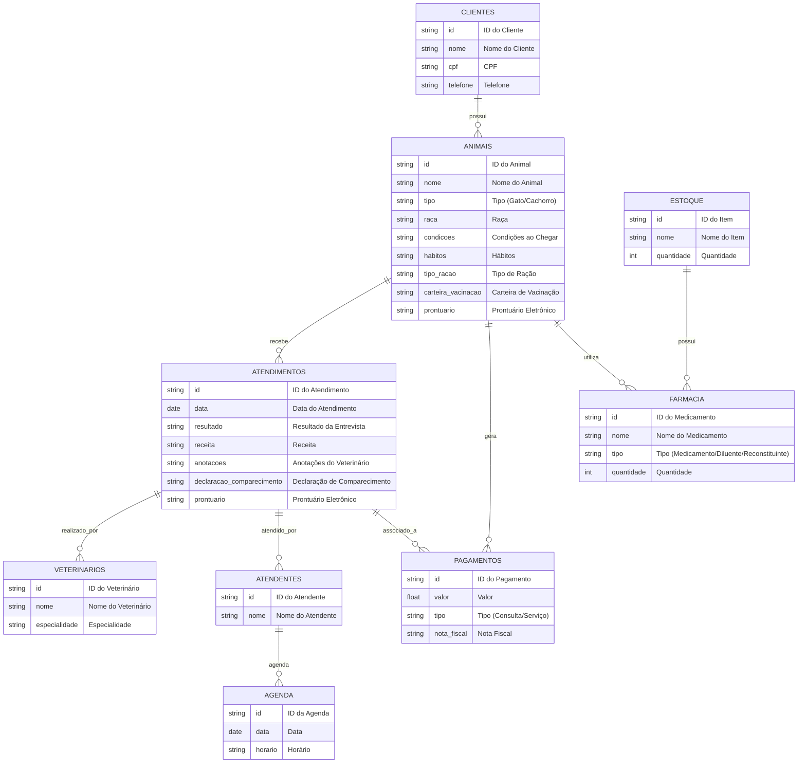

# Repositório da eng. de sw

- [1. Descrição do sistema](#1-descrição-do-sistema)
- [2. Descrição do negócio](#2-descrição-do-negócio)
- [3. Visão geral do sistema.](#3-visão-geral-do-sistema)
- [4. Diagrama ER](#4-diagrama-er)
- [5. Diagrama de classe](#5-diagrama-de-classe)
- [6. Casos de uso](#6-casos-de-uso)
  - [6.1 Histórias de usuário](#61-histórias-de-usuário)
- [7. Diagrama de componentes](#7-diagrama-de-componentes)
- [8. Diagrama de implantação](#8-diagrama-de-implantação)
- [9. Protótipo de telas](#9-protótipo-de-telas)
- [10. Diagrama de navegação de telas](#10-diagrama-de-navegação-de-telas)
- [11. Pilha tecnológica](#11-pilha-tecnológica)
- [12. Requisitos de sistemas](#12-requisitos-de-sistemas)
- [13. Considerações sobre segurança](#13-considerações-sobre-segurança)
- [14. Manutenção e instalação](#14-manutenção-e-instalação)
- [15. Glossário](#15-glossário)
- [16. Script SQL](#16-script-sql)

# 1. Visão geral do problema

O projeto a seguir apresenta um sistema desenvolvido para um PetShop. A empresa é considerada micro e iniciou as atividades recentemente. Ao possuir serviços exclusivos, os sistemas presentes no mercado não se enquadra, desta forma, os proprietários decidiram desenvolver uma solução própria. Esta solução é detalhada a seguir:

# 2. Descrição do negócio

Descrição do cenario onde o sistema deverá funcionar;

1. Marcar animais com RFID
2. Uma clínica veterinária atende apenas os animais: gatos e cachorros.
3. Os clientes devem fazer um cadastro de si e dos animais.
4. Os clientes devem informar as condições nas quais os animais chegam.
5. Os clientes devem informar o tipo de ração que o animal come.
6. O cliente deve informar hábitos do animal.
7. Para cada animal é possível que mais de um veterinário o atenda.
8. Os animais podem chegar e serem atendidos de acordo com uma agenda do dia.
9. Cada animal atendido receberá uma ficha e um prontuário.
10. Outros dono podem querer marcar horários de atendimento futuro.
11. O atendimento gera uma receita para o animal.
12. Quando um cliente chega na clínica veterinária ele é atendido por um atendente.
13. O atendente deve verificar se existe agenda disponível com um veterinário.
14. O atendente deve colocar o cliente e seu animal na fila de espera, se for o caso.
15. O atendente deve levar o cliente e o animal até o veterinário.
16. O veterinário deve realizar uma entrevista com o dono do animal.
17. O resultado da entrevista deve ir para um formulário.
18. O veterinário deverá examinar o animal e anotar em prontuário(ficha) suas observações.
19. Dependendo da situação do animal este receberá uma receita.
20. Integração com sistemas de pagamento: o sistema deve permitir que os clientes paguem consultas e serviços diretamente na plataforma, com a possibilidade de emitir notas fiscais eletrônicas.
21. Notificações automáticas: o sistema deve enviar lembretes automáticos para os clientes sobre consultas agendadas.
22. Histórico médico completo do animal: o sistema deve permitir o acompanhamento detalhado do histórico de saúde, vacinas, exames, cirurgias e medicações do animal.
23. Relatórios financeiros.
24. Controle de estoque de itens cirurgicos.
25. Emissão de carteira de vacinação.
26. Emissão de declaração de comparecimento para tutores.
27. Prontuario eletronico com anamnese, recituario, evolução e alergias.
28. Grid com classificação de risco dos pets internados.
29. Histórico de atendimentos.
30. Módulo de farmacia, constando medicamentos, diluentes e reconstituintes presentes na clínica.

# 3. Visão geral do sistema

# 4. Diagrama ER



# 5. Diagrama de classe

# 6. Casos de uso
## 6.1 Casos de Uso

:bult: **Dica** Situações de utilização do sistema.

!

#6.2.1 História de usuario 1: Cadastro de Cliente 1: Cadastro de cliente

#6.2.2 História de usuario 1: Cadastro de Cliente 2:


# 7. Diagrama de componentes

# 8. Diagrama de implantação

# 9. Protótipo de telas

# 10. Diagrama de navegação de telas

# 11. Pilha tecnologica

# 12. Requisitos de sistema

# 13. Consideraçôes sobre segurança

# 14. Manutenção e instalação

# 15. Glossário

# 16. Script SQL


## 16.1. Comandos CREATE table
```sql
CREATE DATABASE IF NOT EXISTS ClinicaVeterinaria;
USE ClinicaVeterinaria;

-- Tabela CLIENTE
CREATE TABLE CLIENTE (
    ID_Pessoa INT AUTO_INCREMENT PRIMARY KEY,
    Nome VARCHAR(100) NOT NULL,
    Telefone VARCHAR(15),
    Endereco VARCHAR(255),
    Email VARCHAR(100) UNIQUE NOT NULL
);

-- Tabela ANIMAL
CREATE TABLE ANIMAL (
    RFID VARCHAR(50) PRIMARY KEY,
    Nome VARCHAR(100) NOT NULL,
    Tipo ENUM('Gato', 'Cachorro', 'Ave', 'Jabuti', 'Iguana', 'Cobra', 'Furão') NOT NULL,
    Habitos TEXT,
    Condicao_chegada TEXT,
    Tipo_racao VARCHAR(100),
    ID_Pessoa INT,
    FOREIGN KEY (ID_Pessoa) REFERENCES CLIENTE(ID_Pessoa)
);

-- Tabela VETERINARIO
CREATE TABLE VETERINARIO (
    ID_Veterinario INT AUTO_INCREMENT PRIMARY KEY,
    Nome VARCHAR(100) NOT NULL,
    CRMV VARCHAR(20) UNIQUE NOT NULL,
    Especialidade VARCHAR(100)
);

-- Tabela ATENDENTE
CREATE TABLE ATENDENTE (
    ID_Atendente INT AUTO_INCREMENT PRIMARY KEY,
    Nome VARCHAR(100) NOT NULL
);

-- Tabela CONSULTA
CREATE TABLE CONSULTA (
    ID_Consulta INT AUTO_INCREMENT PRIMARY KEY,
    Data DATE NOT NULL,
    Hora TIME NOT NULL,
    Descricao TEXT,
    RFID VARCHAR(50),
    ID_Veterinario INT,
    ID_Atendente INT,
    FOREIGN KEY (RFID) REFERENCES ANIMAL(RFID),
    FOREIGN KEY (ID_Veterinario) REFERENCES VETERINARIO(ID_Veterinario),
    FOREIGN KEY (ID_Atendente) REFERENCES ATENDENTE(ID_Atendente)
);

-- Tabela FICHA
CREATE TABLE FICHA (
    ID_Ficha INT AUTO_INCREMENT PRIMARY KEY,
    Descricao TEXT,
    Observacoes TEXT,
    RFID VARCHAR(50),
    FOREIGN KEY (RFID) REFERENCES ANIMAL(RFID)
);

-- Tabela PRONTUARIO
CREATE TABLE PRONTUARIO (
    ID_Prontuario INT AUTO_INCREMENT PRIMARY KEY,
    Receita TEXT,
    Observacoes TEXT,
    RFID VARCHAR(50),
    FOREIGN KEY (RFID) REFERENCES ANIMAL(RFID)
);

-- Tabela SERVICO
CREATE TABLE SERVICO (
    ID_Servico INT AUTO_INCREMENT PRIMARY KEY,
    Tipo ENUM('Banho', 'Tosa', 'Cirurgia', 'Injeção', 'Curativo', 'Pintura', 'Fisioterapia', 'Nutrição', 'Sobrepeso') NOT NULL,
    Descricao TEXT,
    Preco DECIMAL(10, 2)
);

-- Tabela AGENDA
CREATE TABLE AGENDA (
    ID_Agenda INT AUTO_INCREMENT PRIMARY KEY,
    Data DATE NOT NULL,
    Hora TIME NOT NULL,
    RFID VARCHAR(50),
    ID_Veterinario INT,
    FOREIGN KEY (RFID) REFERENCES ANIMAL(RFID),
    FOREIGN KEY (ID_Veterinario) REFERENCES VETERINARIO(ID_Veterinario)
);

-- Tabela RECEITA
CREATE TABLE RECEITA (
    ID_Receita INT AUTO_INCREMENT PRIMARY KEY,
    Medicamentos TEXT,
    Instrucoes TEXT,
    RFID VARCHAR(50),
    FOREIGN KEY (RFID) REFERENCES ANIMAL(RFID)
);

-- Tabela NOTIFICACAO (para SMS e e-mail)
CREATE TABLE NOTIFICACAO (
    ID_Notificacao INT AUTO_INCREMENT PRIMARY KEY,
    Tipo ENUM('SMS', 'Email') NOT NULL,
    Mensagem TEXT,
    Data DATE NOT NULL,
    Hora TIME NOT NULL,
    ID_Pessoa INT,
    FOREIGN KEY (ID_Pessoa) REFERENCES CLIENTE(ID_Pessoa)
);

-- Tabela VACINACAO
CREATE TABLE VACINACAO (
    ID_Vacinacao INT AUTO_INCREMENT PRIMARY KEY,
    Tipo_Vacina VARCHAR(100) NOT NULL,
    Data DATE NOT NULL,
    RFID VARCHAR(50),
    FOREIGN KEY (RFID) REFERENCES ANIMAL(RFID)
);

-- Tabela LEMBRETE_MEDICAMENTO
CREATE TABLE LEMBRETE_MEDICAMENTO (
    ID_Lembrete INT AUTO_INCREMENT PRIMARY KEY,
    Medicamento VARCHAR(100),
    Data_Lembrete DATE,
    Confirmacao BOOLEAN,
    RFID VARCHAR(50),
    FOREIGN KEY (RFID) REFERENCES ANIMAL(RFID)
);

-- Tabela RECOMENDACAO
CREATE TABLE RECOMENDACAO (
    ID_Recomendacao INT AUTO_INCREMENT PRIMARY KEY,
    Racao_Recomendada VARCHAR(100),
    Suplemento_Recomendado VARCHAR(100),
    RFID VARCHAR(50),
    FOREIGN KEY (RFID) REFERENCES ANIMAL(RFID)
);
```

## 16.2. Comandos INSERT table

```sql
-- Inserir dados na tabela CLIENTE
INSERT INTO CLIENTE (Nome, Telefone, Endereco, Email) VALUES
('João da Silva', '1234-5678', 'Rua das Flores, 123', 'joao.silva@email.com'),
('Maria Oliveira', '9876-5432', 'Avenida Central, 456', 'maria.oliveira@email.com'),
('Carlos Pereira', '5555-6666', 'Praça da Liberdade, 789', 'carlos.pereira@email.com');

-- Inserir dados na tabela ANIMAL
INSERT INTO ANIMAL (RFID, Nome, Tipo, Habitos, Condicao_chegada, Tipo_racao, ID_Pessoa) VALUES
('RFID001', 'Rex', 'Cachorro', 'Muito ativo', 'Machucado', 'Ração Premium', 1),
('RFID002', 'Miau', 'Gato', 'Preguiçoso', 'Saudável', 'Ração Gourmet', 2),
('RFID003', 'Pico', 'Ave', 'Cantor', 'Com febre', 'Ração para Aves', 3);

-- Inserir dados na tabela VETERINARIO
INSERT INTO VETERINARIO (Nome, CRMV, Especialidade) VALUES
('Dr. Pedro Almeida', 'CRMV-12345', 'Clínico Geral'),
('Dra. Ana Costa', 'CRMV-67890', 'Especialista em Aves'),
('Dr. Bruno Santos', 'CRMV-54321', 'Cirurgias');

-- Inserir dados na tabela ATENDENTE
INSERT INTO ATENDENTE (Nome) VALUES
('Lucas Martins'),
('Fernanda Lima');

-- Inserir dados na tabela CONSULTA
INSERT INTO CONSULTA (Data, Hora, Descricao, RFID, ID_Veterinario, ID_Atendente) VALUES
('2024-09-20', '09:00:00', 'Exame de rotina', 'RFID001', 1, 1),
('2024-09-21', '10:00:00', 'Vacinação', 'RFID002', 2, 2),
('2024-09-22', '11:00:00', 'Tratamento de febre', 'RFID003', 1, 2);

-- Inserir dados na tabela FICHA
INSERT INTO FICHA (Descricao, Observacoes, RFID) VALUES
('Ficha de exame de rotina', 'Tudo normal', 'RFID001'),
('Ficha de vacinação', 'Vacinas em dia', 'RFID002'),
('Ficha de tratamento', 'Precisa de cuidados adicionais', 'RFID003');

-- Inserir dados na tabela PRONTUARIO
INSERT INTO PRONTUARIO (Receita, Observacoes, RFID) VALUES
('Ração especial para recuperação', 'Reavaliar em 30 dias', 'RFID001'),
('Vacina contra gripe', 'Manter acompanhamento', 'RFID002'),
('Medicamento para febre', 'Monitorar temperatura', 'RFID003');

-- Inserir dados na tabela SERVICO
INSERT INTO SERVICO (Tipo, Descricao, Preco) VALUES
('Banho', 'Banho completo para cães e gatos', 50.00),
('Tosa', 'Tosa completa para cães', 70.00),
('Cirurgia', 'Cirurgia geral', 300.00),
('Injeção', 'Aplicação de injeção', 40.00),
('Curativo', 'Curativo em feridas', 30.00);

-- Inserir dados na tabela AGENDA
INSERT INTO AGENDA (Data, Hora, RFID, ID_Veterinario) VALUES
('2024-09-23', '08:00:00', 'RFID001', 1),
('2024-09-24', '09:00:00', 'RFID002', 2),
('2024-09-25', '10:00:00', 'RFID003', 3);

-- Inserir dados na tabela RECEITA
INSERT INTO RECEITA (Medicamentos, Instrucoes, RFID) VALUES
('Antibiótico X', 'Administrar 2 vezes ao dia', 'RFID001'),
('Vacina Y', 'Aplicar uma dose', 'RFID002'),
('Antipirético Z', 'Tomar a cada 8 horas', 'RFID003');

-- Inserir dados na tabela NOTIFICACAO
INSERT INTO NOTIFICACAO (Tipo, Mensagem, Data, Hora, ID_Pessoa) VALUES
('SMS', 'Lembrete: Consulta agendada para amanhã.', '2024-09-19', '10:00:00', 1),
('Email', 'Seu animal precisa de uma revisão na próxima semana.', '2024-09-18', '09:00:00', 2);

-- Inserir dados na tabela VACINACAO
INSERT INTO VACINACAO (Tipo_Vacina, Data, RFID) VALUES
('Vacina contra gripe', '2024-09-20', 'RFID002'),
('Vacina antirrábica', '2024-09-25', 'RFID001');

-- Inserir dados na tabela LEMBRETE_MEDICAMENTO
INSERT INTO LEMBRETE_MEDICAMENTO (Medicamento, Data_Lembrete, Confirmacao, RFID) VALUES
('Antibiótico X', '2024-09-22', FALSE, 'RFID001'),
('Antipirético Z', '2024-09-23', FALSE, 'RFID003');

-- Inserir dados na tabela RECOMENDACAO
INSERT INTO RECOMENDACAO (Racao_Recomendada, Suplemento_Recomendado, RFID) VALUES
('Ração Premium', 'Suplemento Vitaminico A', 'RFID001'),
('Ração Gourmet', 'Suplemento Mineral B', 'RFID002');
```
