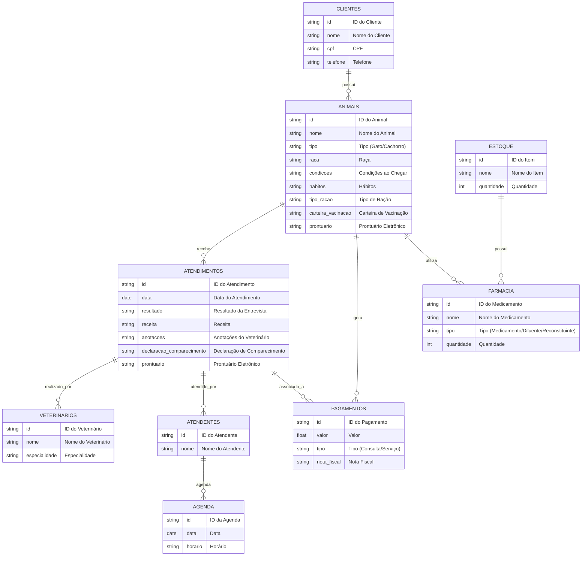

# Repositório da eng. de sw

- [Repositório da eng. de sw](#repositório-da-eng-de-sw)
- [1. Visão geral do problema](#1-visão-geral-do-problema)
- [2. Descrição do negócio](#2-descrição-do-negócio)
- [3. Visão geral do sistema](#3-visão-geral-do-sistema)
- [4. Diagrama ER](#4-diagrama-er)
- [5. Diagrama de classe](#5-diagrama-de-classe)
- [6. Casos de uso](#6-casos-de-uso)
- [7. Diagrama de componentes](#7-diagrama-de-componentes)
- [8. Diagrama de implantação](#8-diagrama-de-implantação)
- [9. Protótipo de telas](#9-protótipo-de-telas)
- [10. Diagrama de navegação de telas](#10-diagrama-de-navegação-de-telas)
- [11. Pilha tecnologica](#11-pilha-tecnologica)
- [12. Requisitos de sistema](#12-requisitos-de-sistema)
- [13. Consideraçôes sobre segurança](#13-consideraçôes-sobre-segurança)
- [14. Manutenção e instalação](#14-manutenção-e-instalação)
- [15. Glossário](#15-glossário)
- [16. Script SQL](#16-script-sql)
  - [16.1. Comandos CREATE table](#161-comandos-create-table)
  - [16.2. Comandos INSERT table](#162-comandos-insert-table)

# 1. Visão geral do problema

O projeto a seguir apresenta um sistema desenvolvido para um PetShop. A empresa é considerada micro e iniciou as atividades recentemente. Ao possuir serviços exclusivos, os sistemas presentes no mercado não se enquadra, desta forma, os proprietários decidiram desenvolver uma solução própria. Esta solução é detalhada a seguir:

# 2. Descrição do negócio

Descrição do cenario onde o sistema deverá funcionar;

1. Marcar animais com RFID
2. Uma clínica veterinária atende apenas os animais: gatos e cachorros.
3. Os clientes devem fazer um cadastro de si e dos animais.
4. Os clientes devem informar as condições nas quais os animais chegam.
5. Os clientes devem informar o tipo de ração que o animal come.
6. O cliente deve informar hábitos do animal.
7. Para cada animal é possível que mais de um veterinário o atenda.
8. Os animais podem chegar e serem atendidos de acordo com uma agenda do dia.
9. Cada animal atendido receberá uma ficha e um prontuário.
10. Outros dono podem querer marcar horários de atendimento futuro.
11. O atendimento gera uma receita para o animal.
12. Quando um cliente chega na clínica veterinária ele é atendido por um atendente.
13. O atendente deve verificar se existe agenda disponível com um veterinário.
14. O atendente deve colocar o cliente e seu animal na fila de espera, se for o caso.
15. O atendente deve levar o cliente e o animal até o veterinário.
16. O veterinário deve realizar uma entrevista com o dono do animal.
17. O resultado da entrevista deve ir para um formulário.
18. O veterinário deverá examinar o animal e anotar em prontuário(ficha) suas observações.
19. Dependendo da situação do animal este receberá uma receita.
20. Integração com sistemas de pagamento: o sistema deve permitir que os clientes paguem consultas e serviços diretamente na plataforma, com a possibilidade de emitir notas fiscais eletrônicas.
21. Notificações automáticas: o sistema deve enviar lembretes automáticos para os clientes sobre consultas agendadas.
22. Histórico médico completo do animal: o sistema deve permitir o acompanhamento detalhado do histórico de saúde, vacinas, exames, cirurgias e medicações do animal.
23. Relatórios financeiros.
24. Controle de estoque de itens cirurgicos.
25. Emissão de carteira de vacinação.
26. Emissão de declaração de comparecimento para tutores.
27. Prontuario eletronico com anamnese, recituario, evolução e alergias.
28. Grid com classificação de risco dos pets internados.
29. Histórico de atendimentos.
30. Módulo de farmacia, constando medicamentos, diluentes e reconstituintes presentes na clínica.

# 3. Visão geral do sistema

# 4. Diagrama ER


# 5. Diagrama de classe

# 6. Casos de uso


# 7. Diagrama de componentes

# 8. Diagrama de implantação

# 9. Protótipo de telas

# 10. Diagrama de navegação de telas

# 11. Pilha tecnologica

# 12. Requisitos de sistema

# 13. Consideraçôes sobre segurança

# 14. Manutenção e instalação

# 15. Glossário

# 16. Script SQL
## 16.1. Comandos CREATE table
```sql
-- Tabela ANIMAIS
CREATE TABLE ANIMAIS (
    id VARCHAR(50) PRIMARY KEY,
    nome VARCHAR(100) NOT NULL,
    tipo VARCHAR(50) NOT NULL,  -- Removido o CHECK, já que MySQL ignora
    raca VARCHAR(100),
    condicoes VARCHAR(255),
    habitos VARCHAR(255),
    tipo_racao VARCHAR(100),
    carteira_vacinacao VARCHAR(255),
    prontuario VARCHAR(255),
    cliente_id VARCHAR(50),
    FOREIGN KEY (cliente_id) REFERENCES CLIENTES(id) ON DELETE CASCADE
);

-- Tabela VETERINARIOS
CREATE TABLE VETERINARIOS (
    id VARCHAR(50) PRIMARY KEY,
    nome VARCHAR(100) NOT NULL,
    especialidade VARCHAR(100)  -- Corrigido o tipo de dado
);

-- Tabela ATENDENTES
CREATE TABLE ATENDENTES (
    id VARCHAR(50) PRIMARY KEY,
    nome VARCHAR(100) NOT NULL
);

-- Tabela ATENDIMENTOS
CREATE TABLE ATENDIMENTOS (
    id VARCHAR(50) PRIMARY KEY,
    data DATE NOT NULL,
    resultado VARCHAR(255),
    receita VARCHAR(255),
    anotacoes VARCHAR(255),
    declaracao_comparecimento VARCHAR(255),
    prontuario VARCHAR(255),
    animal_id VARCHAR(50),
    veterinario_id VARCHAR(50),
    atendente_id VARCHAR(50),
    FOREIGN KEY (animal_id) REFERENCES ANIMAIS(id) ON DELETE CASCADE,
    FOREIGN KEY (veterinario_id) REFERENCES VETERINARIOS(id) ON DELETE SET NULL,
    FOREIGN KEY (atendente_id) REFERENCES ATENDENTES(id) ON DELETE SET NULL
);

-- Tabela AGENDA
CREATE TABLE AGENDA (
    id VARCHAR(50) PRIMARY KEY,
    data DATE NOT NULL,
    horario VARCHAR(5),
    atendente_id VARCHAR(50),
    FOREIGN KEY (atendente_id) REFERENCES ATENDENTES(id) ON DELETE CASCADE
);

-- Tabela PAGAMENTOS
CREATE TABLE PAGAMENTOS (
    id VARCHAR(50) PRIMARY KEY,
    valor FLOAT NOT NULL,
    tipo VARCHAR(50) NOT NULL,  -- Removido o CHECK
    nota_fiscal VARCHAR(255),
    animal_id VARCHAR(50),
    atendimento_id VARCHAR(50),
    FOREIGN KEY (animal_id) REFERENCES ANIMAIS(id) ON DELETE CASCADE,
    FOREIGN KEY (atendimento_id) REFERENCES ATENDIMENTOS(id) ON DELETE CASCADE
);

-- Tabela ESTOQUE
CREATE TABLE ESTOQUE (
    id VARCHAR(50) PRIMARY KEY,
    nome VARCHAR(100) NOT NULL,
    quantidade INT NOT NULL
);

-- Tabela FARMACIA
CREATE TABLE FARMACIA (
    id VARCHAR(50) PRIMARY KEY,
    nome VARCHAR(100) NOT NULL,
    tipo VARCHAR(50) NOT NULL,  -- Removido o CHECK
    quantidade INT NOT NULL,
    estoque_id VARCHAR(50),
    FOREIGN KEY (estoque_id) REFERENCES ESTOQUE(id) ON DELETE CASCADE
);
```

## 16.2. Comandos INSERT table

```sql
-- Populando a tabela CLIENTES
INSERT INTO CLIENTES (id, nome, cpf, telefone)
VALUES 
('C001', 'João Silva', '111.111.111-11', '11999999999'),
('C002', 'Maria Souza', '222.222.222-22', '11988888888'),
('C003', 'Carlos Lima', '333.333.333-33', '11977777777'),
('C004', 'Ana Oliveira', '444.444.444-44', '11966666666'),
('C005', 'Lucas Costa', '555.555.555-55', '11955555555'),
('C006', 'Paula Ferreira', '666.666.666-66', '11944444444'),
('C007', 'Marcos Pereira', '777.777.777-77', '11933333333'),
('C008', 'Fernanda Alves', '888.888.888-88', '11922222222'),
('C009', 'Ricardo Gomes', '999.999.999-99', '11911111111'),
('C010', 'Julia Martins', '101.010.101-01', '11900000000');

-- Populando a tabela ANIMAIS
INSERT INTO ANIMAIS (id, nome, tipo, raca, condicoes, habitos, tipo_racao, carteira_vacinacao, prontuario, cliente_id)
VALUES 
('A001', 'Rex', 'Cachorro', 'Pastor Alemão', 'Ferido na pata', 'Muito ativo', 'Ração Premium', 'Vacinas em dia', 'Sem alergias', 'C001'),
('A002', 'Mia', 'Gato', 'Siamês', 'Febre', 'Dorminhoca', 'Ração Light', 'Vacinas em dia', 'Alergia a frango', 'C002'),
('A003', 'Thor', 'Cachorro', 'Labrador', 'Desidratado', 'Adora brincar', 'Ração Standard', 'Vacinas atrasadas', 'Sem alergias', 'C003'),
('A004', 'Bella', 'Gato', 'Persa', 'Infecção ocular', 'Calma', 'Ração Premium', 'Vacinas em dia', 'Sem alergias', 'C004'),
('A005', 'Max', 'Cachorro', 'Bulldog', 'Problema respiratório', 'Preguiçoso', 'Ração Especial', 'Vacinas em dia', 'Alergia a glúten', 'C005'),
('A006', 'Luna', 'Gato', 'Angorá', 'Vômito', 'Muito ativa', 'Ração Light', 'Vacinas em dia', 'Alergia a carne bovina', 'C006'),
('A007', 'Toby', 'Cachorro', 'Beagle', 'Pulgas', 'Curioso', 'Ração Premium', 'Vacinas em dia', 'Sem alergias', 'C007'),
('A008', 'Nina', 'Gato', 'Maine Coon', 'Problema renal', 'Muito tranquila', 'Ração Especial', 'Vacinas atrasadas', 'Sem alergias', 'C008'),
('A009', 'Simba', 'Cachorro', 'Golden Retriever', 'Infecção no ouvido', 'Adora correr', 'Ração Standard', 'Vacinas em dia', 'Sem alergias', 'C009'),
('A010', 'Chloe', 'Gato', 'Ragdoll', 'Alergia na pele', 'Muito carinhosa', 'Ração Premium', 'Vacinas em dia', 'Alergia a peixes', 'C010');

-- Populando a tabela VETERINARIOS
INSERT INTO VETERINARIOS (id, nome, especialidade)
VALUES 
('V001', 'Dr. Fernando', 'Clínica Geral'),
('V002', 'Dr. Camila', 'Dermatologia'),
('V003', 'Dr. Pedro', 'Cardiologia'),
('V004', 'Dra. Ana', 'Ortopedia'),
('V005', 'Dr. Lucas', 'Endocrinologia'),
('V006', 'Dra. Paula', 'Neurologia'),
('V007', 'Dr. João', 'Oftalmologia'),
('V008', 'Dra. Mariana', 'Oncologia'),
('V009', 'Dr. Roberto', 'Nefrologia'),
('V010', 'Dra. Clara', 'Gastroenterologia');

-- Populando a tabela ATENDENTES
INSERT INTO ATENDENTES (id, nome)
VALUES 
('AT001', 'Alice'),
('AT002', 'Bruno'),
('AT003', 'Carla'),
('AT004', 'Diego'),
('AT005', 'Elisa'),
('AT006', 'Felipe'),
('AT007', 'Gabriela'),
('AT008', 'Hugo'),
('AT009', 'Isabela'),
('AT010', 'João');

-- Populando a tabela ATENDIMENTOS
INSERT INTO ATENDIMENTOS (id, data, resultado, receita, anotacoes, declaracao_comparecimento, prontuario, animal_id, veterinario_id, atendente_id)
VALUES 
('ATD001', '2024-09-01', 'Exame físico completo', 'Antibiótico', 'Animal estável', 'Declaração entregue', 'Sem novos sintomas', 'A001', 'V001', 'AT001'),
('ATD002', '2024-09-02', 'Consulta de rotina', 'Ração especial', 'Alergia controlada', 'Declaração entregue', 'Animal em tratamento', 'A002', 'V002', 'AT002'),
('ATD003', '2024-09-03', 'Tratamento de desidratação', 'Soro fisiológico', 'Animal se recuperando', 'Declaração entregue', 'Sem novos sintomas', 'A003', 'V003', 'AT003'),
('ATD004', '2024-09-04', 'Infecção ocular tratada', 'Colírio', 'Animal estável', 'Declaração entregue', 'Sem novos sintomas', 'A004', 'V004', 'AT004'),
('ATD005', '2024-09-05', 'Problema respiratório', 'Broncodilatador', 'Animal com dificuldade respiratória', 'Declaração entregue', 'Monitoramento contínuo', 'A005', 'V005', 'AT005'),
('ATD006', '2024-09-06', 'Vômito persistente', 'Antiemético', 'Animal em observação', 'Declaração entregue', 'Sem novos sintomas', 'A006', 'V006', 'AT006'),
('ATD007', '2024-09-07', 'Tratamento de pulgas', 'Antipulgas', 'Animal estável', 'Declaração entregue', 'Sem novos sintomas', 'A007', 'V007', 'AT007'),
('ATD008', '2024-09-08', 'Problema renal tratado', 'Medicamento renal', 'Animal estável', 'Declaração entregue', 'Animal em recuperação', 'A008', 'V008', 'AT008'),
('ATD009', '2024-09-09', 'Infecção no ouvido', 'Antibiótico', 'Animal estável', 'Declaração entregue', 'Animal se recuperando', 'A009', 'V009', 'AT009'),
('ATD010', '2024-09-10', 'Alergia tratada', 'Corticosteroide', 'Animal sem sintomas', 'Declaração entregue', 'Monitoramento contínuo', 'A010', 'V010', 'AT010');

-- Populando a tabela AGENDA
INSERT INTO AGENDA (id, data, horario, atendente_id)
VALUES 
('AG001', '2024-09-01', '09:00', 'AT001'),
('AG002', '2024-09-02', '10:00', 'AT002'),
('AG003', '2024-09-03', '11:00', 'AT003'),
('AG004', '2024-09-04', '12:00', 'AT004'),
('AG005', '2024-09-05', '13:00', 'AT005'),
('AG006', '2024-09-06', '14:00', 'AT006'),
('AG007', '2024-09-07', '15:00', 'AT007'),
('AG008', '2024-09-08', '16:00', 'AT008'),
('AG009', '2024-09-09', '17:00', 'AT009'),
('AG010', '2024-09-10', '18:00', 'AT010');

-- Populando a tabela PAGAMENTOS
INSERT INTO PAGAMENTOS (id, valor, tipo, nota_fiscal, animal_id, atendimento_id)
VALUES 
('PAG001', 150.00, 'Consulta', 'NF001', 'A001', 'ATD001'),
('PAG002', 200.00, 'Serviço', 'NF002', 'A002', 'ATD002'),
('PAG003', 180.00, 'Consulta', 'NF003', 'A003', 'ATD003'),
```
