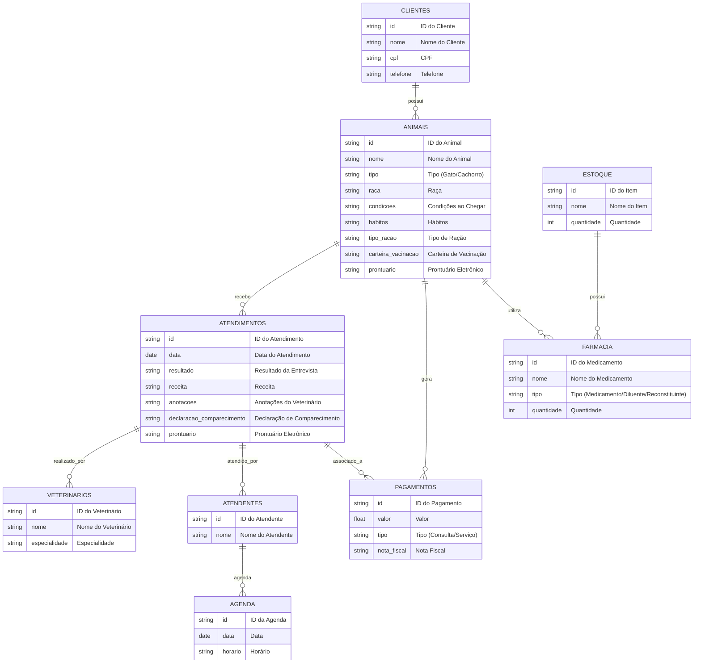
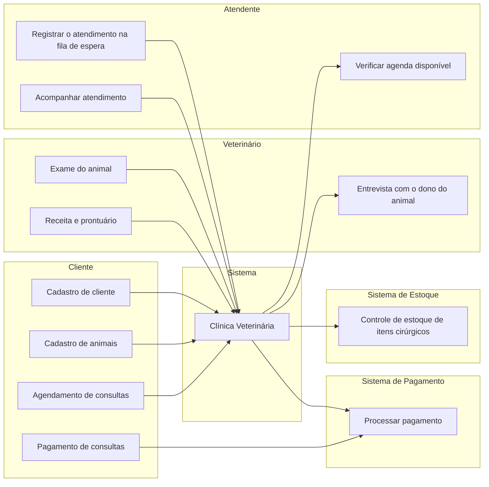
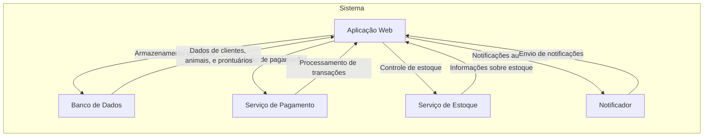
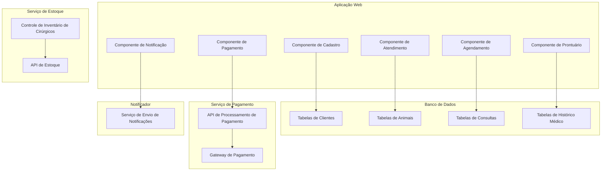
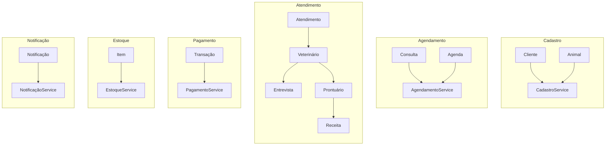
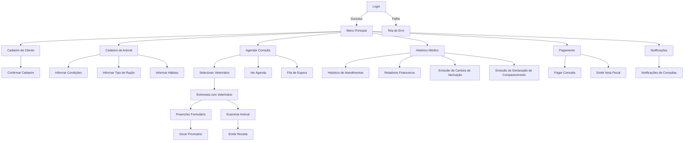

# **Repositório de Engenharia de Software - Sistema para PetShop**

Este repositório documenta o desenvolvimento de um sistema exclusivo para uma clínica veterinária especializada em gatos e cachorros. O objetivo é otimizar o gerenciamento de consultas, prontuários, estoque e outros serviços essenciais para o atendimento animal.

## **Índice**
- [**Repositório de Engenharia de Software - Sistema para PetShop**](#repositório-de-engenharia-de-software---sistema-para-petshop)
  - [**Índice**](#índice)
- [**1. Visão Geral do Problema**](#1-visão-geral-do-problema)
- [2. Descrição do negócio](#2-descrição-do-negócio)
- [**🐾 Principais Funcionalidades do Sistema 🐾**](#-principais-funcionalidades-do-sistema-)
  - [2.1 Requisitos](#21-requisitos)
    - [Requisitos Funcionais e Não Funcionais](#requisitos-funcionais-e-não-funcionais)
- [3. Visão geral do sistema](#3-visão-geral-do-sistema)
- [4. Diagrama ER](#4-diagrama-er)
- [5. Diagrama de classe](#5-diagrama-de-classe)
- [6. Casos de uso](#6-casos-de-uso)
  - [6.1 Casos de uso](#61-casos-de-uso)
  - [6.2 História de usuário](#62-história-de-usuário)
    - [1. Marcar animais com RFID](#1-marcar-animais-com-rfid)
    - [2. Atender apenas gatos e cachorros](#2-atender-apenas-gatos-e-cachorros)
    - [3. Cadastro de clientes e animais](#3-cadastro-de-clientes-e-animais)
    - [4. Informar condições do animal](#4-informar-condições-do-animal)
    - [5. Informar tipo de ração do animal](#5-informar-tipo-de-ração-do-animal)
    - [6. Informar hábitos do animal](#6-informar-hábitos-do-animal)
    - [7. Atendimento por vários veterinários](#7-atendimento-por-vários-veterinários)
    - [8. Agendamento de consultas](#8-agendamento-de-consultas)
    - [9. Ficha e prontuário para cada animal](#9-ficha-e-prontuário-para-cada-animal)
    - [10. Agendamento de consultas futuras](#10-agendamento-de-consultas-futuras)
    - [11. Receita gerada no atendimento](#11-receita-gerada-no-atendimento)
    - [12. Atendimento inicial pelo atendente](#12-atendimento-inicial-pelo-atendente)
    - [13. Verificação de agenda pelo atendente](#13-verificação-de-agenda-pelo-atendente)
    - [14. Colocar cliente na fila de espera](#14-colocar-cliente-na-fila-de-espera)
    - [15. Levar cliente ao veterinário](#15-levar-cliente-ao-veterinário)
    - [16. Realizar entrevista com o dono](#16-realizar-entrevista-com-o-dono)
    - [17. Resultado da entrevista em formulário](#17-resultado-da-entrevista-em-formulário)
    - [18. Exame do animal e anotações no prontuário](#18-exame-do-animal-e-anotações-no-prontuário)
    - [19. Receita para o animal](#19-receita-para-o-animal)
    - [20. Pagamento de consultas e serviços](#20-pagamento-de-consultas-e-serviços)
    - [21. Notificações automáticas de lembrete](#21-notificações-automáticas-de-lembrete)
    - [22. Histórico médico completo do animal](#22-histórico-médico-completo-do-animal)
    - [23. Relatórios financeiros](#23-relatórios-financeiros)
    - [24. Controle de estoque de itens cirúrgicos](#24-controle-de-estoque-de-itens-cirúrgicos)
    - [25. Emissão de carteira de vacinação](#25-emissão-de-carteira-de-vacinação)
    - [26. Emissão de declaração de comparecimento](#26-emissão-de-declaração-de-comparecimento)
    - [27. Prontuário eletrônico completo](#27-prontuário-eletrônico-completo)
    - [28. Grid de classificação de risco dos pets](#28-grid-de-classificação-de-risco-dos-pets)
    - [29. Histórico de atendimentos](#29-histórico-de-atendimentos)
    - [30. Módulo de farmácia](#30-módulo-de-farmácia)
- [7. Diagrama de componentes](#7-diagrama-de-componentes)
- [8. Diagrama de implantação](#8-diagrama-de-implantação)
- [9. Diagrama C4](#9-diagrama-c4)
  - [9.1 Diagrama de contexto](#91-diagrama-de-contexto)
  - [9.2 Diagrama de container](#92-diagrama-de-container)
  - [9.3 Diagrama de componentes](#93-diagrama-de-componentes)
  - [9.4 Diagrama de codigo](#94-diagrama-de-codigo)
- [10. Protótipo de telas](#10-protótipo-de-telas)
- [11. Diagrama de navegação de telas](#11-diagrama-de-navegação-de-telas)
- [12. Pilha tecnologica](#12-pilha-tecnologica)
- [13. Requisitos de sistema](#13-requisitos-de-sistema)
  - [13.1 Requisitos do lado do cliente](#131-requisitos-do-lado-do-cliente)
    - [1. Requisitos de Hardware](#1-requisitos-de-hardware)
    - [2. Requisitos de Sistema Operacional](#2-requisitos-de-sistema-operacional)
    - [3. Requisitos de Navegador](#3-requisitos-de-navegador)
    - [4. Requisitos de Rede](#4-requisitos-de-rede)
    - [5. Requisitos de Software](#5-requisitos-de-software)
    - [6. Requisitos de Acessibilidade](#6-requisitos-de-acessibilidade)
    - [7. Outros Requisitos](#7-outros-requisitos)
  - [13.2 Requisitos do lado do servidor](#132-requisitos-do-lado-do-servidor)
    - [1. Requisitos de Hardware](#1-requisitos-de-hardware-1)
    - [2. Requisitos de Sistema Operacional](#2-requisitos-de-sistema-operacional-1)
    - [3. Requisitos de Software](#3-requisitos-de-software)
    - [4. Requisitos de Rede](#4-requisitos-de-rede-1)
    - [5. Requisitos de Desempenho](#5-requisitos-de-desempenho)
    - [6. Requisitos de Segurança](#6-requisitos-de-segurança)
    - [7. Monitoramento e Manutenção](#7-monitoramento-e-manutenção)
- [14. Consideração sobre segurança](#14-consideração-sobre-segurança)
  - [14.1. Lado cliente](#141-lado-cliente)
  - [14.2 Lado servidor](#142-lado-servidor)
- [15. Manutenção e instalação](#15-manutenção-e-instalação)
  - [1. Instalação](#1-instalação)
    - [1.1. Requisitos de Sistema](#11-requisitos-de-sistema)
    - [1.2. Procedimento de Instalação](#12-procedimento-de-instalação)
    - [1.3. Configuração Inicial](#13-configuração-inicial)
  - [2. Funcionalidades](#2-funcionalidades)
    - [2.1. Interface do Usuário](#21-interface-do-usuário)
    - [2.2. Autenticação](#22-autenticação)
    - [2.3. Manipulação de Dados](#23-manipulação-de-dados)
    - [2.4. Notificações](#24-notificações)
  - [3. Manutenção](#3-manutenção)
    - [3.1. Atualizações de Sistema](#31-atualizações-de-sistema)
    - [3.2. Suporte Técnico](#32-suporte-técnico)
    - [3.3. Monitoramento e Feedback](#33-monitoramento-e-feedback)
- [16. Treinamento](#16-treinamento)
- [17. Script SQL](#17-script-sql)
  - [17.1. Comandos CREATE table](#171-comandos-create-table)
  - [17.2. Comandos INSERT table](#172-comandos-insert-table)


# **1. Visão Geral do Problema**

O sistema é projetado para atender uma clínica veterinária de pequeno porte especializada em gatos e cachorros. O mercado não oferece soluções que atendam às necessidades específicas do negócio, e por isso, foi decidido o desenvolvimento de uma plataforma própria.

[Voltar ao inicio](#repositório-de-engenharia-de-software---sistema-para-petshop)
# 2. Descrição do negócio

Descrição do cenário onde o sistema deverá funcionar:

# **🐾 Principais Funcionalidades do Sistema 🐾**

> Abaixo estão listadas as principais funcionalidades e recursos do sistema desenvolvido para o gerenciamento completo de uma clínica veterinária especializada em gatos e cachorros.


1. Marcar animais com RFID
2. Uma clínica veterinária atende apenas os animais: gatos e cachorros.
3. Os clientes devem fazer um cadastro de si e dos animais.
4. Os clientes devem informar as condições nas quais os animais chegam.
5. Os clientes devem informar o tipo de ração que o animal come.
6. O cliente deve informar hábitos do animal.
7. Para cada animal é possível que mais de um veterinário o atenda.
8. Os animais podem chegar e serem atendidos de acordo com uma agenda do dia.
9. Cada animal atendido receberá uma ficha e um prontuário.
10. Outros dono podem querer marcar horários de atendimento futuro.
11. O atendimento gera uma receita para o animal.
12. Quando um cliente chega na clínica veterinária ele é atendido por um atendente.
13. O atendente deve verificar se existe agenda disponível com um veterinário.
14. O atendente deve colocar o cliente e seu animal na fila de espera, se for o caso.
15. O atendente deve levar o cliente e o animal até o veterinário.
16. O veterinário deve realizar uma entrevista com o dono do animal.
17. O resultado da entrevista deve ir para um formulário.
18. O veterinário deverá examinar o animal e anotar em prontuário(ficha) suas observações.
19. Dependendo da situação do animal este receberá uma receita.
20. Integração com sistemas de pagamento: o sistema deve permitir que os clientes paguem consultas e serviços diretamente na plataforma, com a possibilidade de emitir notas fiscais eletrônicas.
21. Notificações automáticas: o sistema deve enviar lembretes automáticos para os clientes sobre consultas agendadas.
22. Histórico médico completo do animal: o sistema deve permitir o acompanhamento detalhado do histórico de saúde, vacinas, exames, cirurgias e medicações do animal.
23. Relatórios financeiros.
24. Controle de estoque de itens cirurgicos.
25. Emissão de carteira de vacinação.
26. Emissão de declaração de comparecimento para tutores.
27. Prontuario eletronico com anamnese, recituario, evolução e alergias.
28. Grid com classificação de risco dos pets internados.
29. Histórico de atendimentos.
30. Módulo de farmacia, constando medicamentos, diluentes e reconstituintes presentes na clínica.

## 2.1 Requisitos

### Requisitos Funcionais e Não Funcionais

| **Tipo**          | **Requisito**                                                                                               |
| ----------------- | ----------------------------------------------------------------------------------------------------------- |
| **Funcional**     | 1. Marcar animais com RFID                                                                                  |
| **Funcional**     | 2. A clínica veterinária atende apenas gatos e cachorros                                                    |
| **Funcional**     | 3. O cliente deve cadastrar a si mesmo e seus animais                                                       |
| **Funcional**     | 4. O cliente deve informar as condições nas quais os animais chegam                                         |
| **Funcional**     | 5. O cliente deve informar o tipo de ração que o animal consome                                             |
| **Funcional**     | 6. O cliente deve informar os hábitos do animal                                                             |
| **Funcional**     | 7. Mais de um veterinário pode atender um animal                                                            |
| **Funcional**     | 8. Os animais são atendidos de acordo com a agenda do dia                                                   |
| **Funcional**     | 9. Cada animal atendido recebe uma ficha e um prontuário                                                    |
| **Funcional**     | 10. Outros donos podem agendar atendimento futuro                                                           |
| **Funcional**     | 11. O atendimento gera uma receita para o animal                                                            |
| **Funcional**     | 12. O atendente verifica a disponibilidade de agenda do veterinário                                         |
| **Funcional**     | 13. O atendente pode colocar o cliente e o animal na fila de espera, se necessário                          |
| **Funcional**     | 14. O atendente leva o cliente e o animal até o veterinário                                                 |
| **Funcional**     | 15. O veterinário realiza uma entrevista com o dono do animal                                               |
| **Funcional**     | 16. O resultado da entrevista deve ser registrado em um formulário                                          |
| **Funcional**     | 17. O veterinário examina o animal e anota suas observações no prontuário                                   |
| **Funcional**     | 18. Dependendo do diagnóstico, o animal recebe uma receita                                                  |
| **Funcional**     | 19. Integração com sistemas de pagamento para pagamento de consultas e serviços                             |
| **Funcional**     | 20. O sistema envia notificações automáticas para clientes sobre consultas agendadas                        |
| **Funcional**     | 21. Histórico médico completo do animal, incluindo vacinas, exames, cirurgias e medicações                  |
| **Funcional**     | 22. O sistema permite gerar relatórios financeiros                                                          |
| **Funcional**     | 23. Controle de estoque de itens cirúrgicos                                                                 |
| **Funcional**     | 24. Emissão de carteira de vacinação para os animais                                                        |
| **Funcional**     | 25. Emissão de declaração de comparecimento para os tutores                                                 |
| **Funcional**     | 26. Prontuário eletrônico contendo anamnese, receituário, evolução e alergias                               |
| **Funcional**     | 27. Sistema inclui grid de classificação de risco dos pets internados                                       |
| **Funcional**     | 28. Histórico de atendimentos disponíveis para consulta                                                     |
| **Funcional**     | 29. Módulo de farmácia com medicamentos, diluentes e reconstituintes disponíveis na clínica                 |
| **Não Funcional** | 1. O sistema deve ser acessível via navegador web em diferentes dispositivos (desktop e mobile)             |
| **Não Funcional** | 2. O sistema deve garantir a segurança das informações dos clientes e dos animais (proteção de dados)       |
| **Não Funcional** | 3. O sistema deve ser escalável para suportar um aumento no número de clientes e animais atendidos          |
| **Não Funcional** | 4. O tempo de resposta do sistema para realizar consultas e salvar dados deve ser inferior a 2 segundos     |
| **Não Funcional** | 5. O sistema deve ser tolerante a falhas, com backup e recuperação de dados em caso de erro                 |
| **Não Funcional** | 6. A interface do usuário deve ser amigável e fácil de navegar para atender diferentes perfis de usuários   |
| **Não Funcional** | 7. O sistema deve ser compatível com sistemas operacionais como Windows, macOS, Linux e plataformas móveis  |
| **Não Funcional** | 8. O sistema deve garantir alta disponibilidade (99,9% de uptime) e ser resiliente a falhas                 |
| **Não Funcional** | 9. O sistema deve ter integração com sistemas externos, como plataformas de pagamento e sistemas de estoque |
| **Não Funcional** | 10. O sistema deve ser auditável e registrar todas as ações feitas pelos usuários para fins de segurança    |
[Voltar ao inicio](#repositório-de-engenharia-de-software---sistema-para-petshop)

# 3. Visão geral do sistema
1. **Cadastro de Usuário e Animais**: Registro de informações pessoais e dos animais (gatos e cachorros).

2. **Informações de Saúde**: Possibilidade de informar condições de saúde, tipo de ração e hábitos do animal.

3. **Agendamento e Atendimento**:
   - Verificação de agenda disponível com veterinários.
   - Fila de espera para atendimento, se necessário.

4. **Entrevista com Veterinário**: Realização de entrevistas para entender melhor a situação do animal.

5. **Prontuário Eletrônico**: Anotações de observações e histórico médico do animal.

6. **Receitas Médicas**: Prescrição de medicamentos e tratamentos, com entrega de receita ao usuário.

7. **Integração com Sistema de Pagamento**: Pagamento de consultas e serviços diretamente na plataforma, com emissão de notas fiscais eletrônicas.

8. **Notificações Automáticas**: Lembretes sobre consultas agendadas.

9. **Histórico Médico Completo**: Acompanhamento detalhado de saúde, vacinas, exames, cirurgias e medicações do animal.

10. **Emissão de Documentos**: Emissão de carteiras de vacinação e declarações de comparecimento.

11. **Módulo de Farmácia**: Acesso a medicamentos disponíveis na clínica.

[Voltar ao inicio](#repositório-de-engenharia-de-software---sistema-para-petshop)

# 4. Diagrama ER

[Voltar ao inicio](#repositório-de-engenharia-de-software---sistema-para-petshop)

# 5. Diagrama de classe

[Voltar ao inicio](#repositório-de-engenharia-de-software---sistema-para-petshop)

# 6. Casos de uso
  ## 6.1 Casos de uso


  ## 6.2 História de usuário
### 1. Marcar animais com RFID
**Como** um atendente,  
**Eu quero** marcar cada animal com um código RFID,  
**Para que** possamos rastrear e identificar os animais de forma eficiente.

### 2. Atender apenas gatos e cachorros
**Como** um gerente de clínica veterinária,  
**Eu quero** garantir que a clínica atenda apenas gatos e cachorros,  
**Para que** possamos especializar nossos serviços nesses tipos de animais.

### 3. Cadastro de clientes e animais
**Como** um cliente,  
**Eu quero** cadastrar minhas informações pessoais e as informações do meu animal,  
**Para que** o veterinário tenha todos os dados necessários para o atendimento.

### 4. Informar condições do animal
**Como** um cliente,  
**Eu quero** informar as condições nas quais o meu animal chegou à clínica,  
**Para que** o veterinário tenha um histórico preciso da condição de saúde do meu pet.

### 5. Informar tipo de ração do animal
**Como** um cliente,  
**Eu quero** informar o tipo de ração que meu animal come,  
**Para que** o veterinário tenha informações nutricionais relevantes.

### 6. Informar hábitos do animal
**Como** um cliente,  
**Eu quero** informar os hábitos do meu animal,  
**Para que** o veterinário possa considerar isso durante o diagnóstico e tratamento.

### 7. Atendimento por vários veterinários
**Como** um cliente,  
**Eu quero** que o meu animal possa ser atendido por mais de um veterinário,  
**Para que** ele receba cuidados de especialistas diferentes, conforme necessário.

### 8. Agendamento de consultas
**Como** um cliente,  
**Eu quero** que o meu animal seja atendido de acordo com uma agenda definida,  
**Para que** eu possa planejar o atendimento de forma eficiente.

### 9. Ficha e prontuário para cada animal
**Como** um veterinário,  
**Eu quero** criar uma ficha e um prontuário para cada animal atendido,  
**Para que** possamos registrar todas as informações relevantes sobre a saúde do animal.

### 10. Agendamento de consultas futuras
**Como** um cliente,  
**Eu quero** poder marcar horários de atendimento futuros,  
**Para que** eu garanta o atendimento em datas convenientes.

### 11. Receita gerada no atendimento
**Como** um veterinário,  
**Eu quero** gerar uma receita ao final de cada atendimento,  
**Para que** o cliente tenha as recomendações de medicamentos ou tratamentos necessários.

### 12. Atendimento inicial pelo atendente
**Como** um cliente,  
**Eu quero** ser atendido por um atendente quando eu chegar à clínica,  
**Para que** ele me oriente e inicie o processo de atendimento.

### 13. Verificação de agenda pelo atendente
**Como** um atendente,  
**Eu quero** verificar se existe uma agenda disponível para o veterinário,  
**Para que** eu possa organizar o atendimento do cliente e do animal.

### 14. Colocar cliente na fila de espera
**Como** um atendente,  
**Eu quero** colocar o cliente e seu animal na fila de espera,  
**Para que** eles sejam atendidos na ordem correta, se não houver agenda disponível.

### 15. Levar cliente ao veterinário
**Como** um atendente,  
**Eu quero** levar o cliente e seu animal até o veterinário,  
**Para que** eles possam iniciar a consulta.

### 16. Realizar entrevista com o dono
**Como** um veterinário,  
**Eu quero** realizar uma entrevista com o dono do animal,  
**Para que** eu tenha informações detalhadas para iniciar o exame.

### 17. Resultado da entrevista em formulário
**Como** um veterinário,  
**Eu quero** registrar o resultado da entrevista em um formulário,  
**Para que** as informações fiquem documentadas e disponíveis no prontuário.

### 18. Exame do animal e anotações no prontuário
**Como** um veterinário,  
**Eu quero** examinar o animal e anotar as observações no prontuário,  
**Para que** haja um registro completo do atendimento.

### 19. Receita para o animal
**Como** um veterinário,  
**Eu quero** prescrever uma receita para o animal,  
**Para que** ele receba os tratamentos ou medicamentos adequados.

### 20. Pagamento de consultas e serviços
**Como** um cliente,  
**Eu quero** pagar minhas consultas e serviços diretamente na plataforma,  
**Para que** eu tenha uma experiência integrada e simples, com a emissão de nota fiscal.

### 21. Notificações automáticas de lembrete
**Como** um cliente,  
**Eu quero** receber notificações automáticas de lembrete para consultas agendadas,  
**Para que** eu não perca o horário do atendimento.

### 22. Histórico médico completo do animal
**Como** um veterinário,  
**Eu quero** acompanhar o histórico médico completo do animal,  
**Para que** eu possa monitorar a saúde, vacinas, exames, cirurgias e medicações.

### 23. Relatórios financeiros
**Como** um gerente,  
**Eu quero** gerar relatórios financeiros detalhados,  
**Para que** eu possa acompanhar o desempenho financeiro da clínica.

### 24. Controle de estoque de itens cirúrgicos
**Como** um gerente,  
**Eu quero** gerenciar o estoque de itens cirúrgicos,  
**Para que** a clínica tenha sempre os materiais necessários para os procedimentos.

### 25. Emissão de carteira de vacinação
**Como** um veterinário,  
**Eu quero** emitir uma carteira de vacinação para o animal,  
**Para que** o dono tenha o controle das vacinas aplicadas.

### 26. Emissão de declaração de comparecimento
**Como** um atendente,  
**Eu quero** emitir uma declaração de comparecimento para os tutores,  
**Para que** eles possam justificar sua presença na clínica, se necessário.

### 27. Prontuário eletrônico completo
**Como** um veterinário,  
**Eu quero** registrar o prontuário eletrônico com anamnese, receitas, evolução e alergias,  
**Para que** o histórico de saúde do animal seja completo e acessível.

### 28. Grid de classificação de risco dos pets
**Como** um veterinário,  
**Eu quero** visualizar um grid com a classificação de risco dos pets internados,  
**Para que** possamos priorizar os cuidados de acordo com a urgência.

### 29. Histórico de atendimentos
**Como** um cliente,  
**Eu quero** acessar o histórico completo dos atendimentos do meu animal,  
**Para que** eu tenha um registro de todas as consultas e tratamentos.

### 30. Módulo de farmácia
**Como** um farmacêutico da clínica,  
**Eu quero** gerenciar os medicamentos, diluentes e reconstituintes presentes na clínica,  
**Para que** o estoque esteja sempre atualizado e os tratamentos sejam realizados sem interrupções.
[Voltar ao inicio](#repositório-de-engenharia-de-software---sistema-para-petshop)

# 7. Diagrama de componentes

[Voltar ao inicio](#repositório-de-engenharia-de-software---sistema-para-petshop)

# 8. Diagrama de implantação

[Voltar ao inicio](#repositório-de-engenharia-de-software---sistema-para-petshop)

# 9. Diagrama C4

## 9.1 Diagrama de contexto

## 9.2 Diagrama de container

## 9.3 Diagrama de componentes

## 9.4 Diagrama de codigo


[Voltar ao inicio](#repositório-de-engenharia-de-software---sistema-para-petshop)

# 10. Protótipo de telas


[Voltar ao inicio](#repositório-de-engenharia-de-software---sistema-para-petshop)

# 11. Diagrama de navegação de telas

[Voltar ao inicio](#repositório-de-engenharia-de-software---sistema-para-petshop)

# 12. Pilha tecnologica


# 13. Requisitos de sistema

## 13.1 Requisitos do lado do cliente 

### 1. Requisitos de Hardware
- **Processador**: Mínimo de [especificar modelo e velocidade, por exemplo, Intel i3 ou equivalente].
- **Memória RAM**: Mínimo de 4gb.
- **Espaço em Disco**: Mínimo de  10 gb de espaço livre no disco rígido.
- **Placa de Vídeo**: Compatível com  DirectX 11 ou OpenGL 3.3.

### 2. Requisitos de Sistema Operacional
- **Windows**: Versões suportadas:  Windows 10 ou superior.
- **macOS**: Versões suportadas: macOS Mojave ou superior.
- **Linux**: Distribuições suportadas: Ubuntu 20.04 ou superior.

### 3. Requisitos de Navegador
- **Habilitação de Cookies**: O navegador deve permitir cookies.
- **JavaScript**: O JavaScript deve estar habilitado.

### 4. Requisitos de Rede
- **Conexão à Internet**: Conexão de banda larga estável (recomenda-se velocidade mínima de 1 Mbps).
- **Firewall/Antivírus**: O software deve ser configurado para permitir o acesso à internet, desativando restrições que impeçam a comunicação.

### 5. Requisitos de Software
- **Atualizações**: O sistema deve estar atualizado com os últimos patches de segurança e atualizações do sistema operacional.

### 6. Requisitos de Acessibilidade
- **Recursos de Acessibilidade**: Deve ser compatível com recursos de acessibilidade do sistema operacional 

### 7. Outros Requisitos
- **Permissões de Usuário**: O usuário deve ter permissões de admin adequadas para instalar o software.

## 13.2 Requisitos do lado do servidor 

### 1. Requisitos de Hardware
- **Processador**: Mínimo de Intel Xeon E5 ou equivalente.
- **Memória RAM**: Mínimo de 16 GB.
- **Espaço em Disco**: Mínimo de 100 GB de espaço livre no disco rígido.
- **Placa de Rede**: Compatível com conexões Ethernet de alta velocidade.

### 2. Requisitos de Sistema Operacional
- **Windows Server**: Versões suportadas: Windows Server 2019 ou superior.
- **Linux**: Distribuições suportadas: Ubuntu Server 20.04, CentOS 8, Debian 10.
- **Virtualização**: Suporte para ambientes virtuais como VMware e Hyper-V.

### 3. Requisitos de Software
- **Servidor Web**: Instalação de servidores web como Apache ou Nginx.
- **Banco de Dados**: Sistemas de gerenciamento de banco de dados suportados: MySQL e PostgreSQL.
- **Ambiente de Execução**: Java JDK 11 e Node.js.
- **Dependências Adicionais**: Bibliotecas de suporte, como Redis ou Memcached.

### 4. Requisitos de Rede
- **Conexão à Internet**: Conexão de banda larga estável com IP estático.
- **Firewall**: Configuração adequada para permitir tráfego nas portas 80 e 443 para HTTP/HTTPS.
- **Segurança de Rede**: Implementação de VPN para acesso remoto seguro.

### 5. Requisitos de Desempenho
- **Capacidade de Carga**: O servidor deve ser capaz de suportar um número mínimo de 200 conexões simultâneas.
- **Backup e Redundância**: Estratégias de backup regulares e soluções de redundância para garantir alta disponibilidade.

### 6. Requisitos de Segurança
- **Criptografia**: Implementação de HTTPS para comunicação segura.
- **Autenticação**: Métodos de autenticação robustos, como autenticação multifator.
- **Atualizações de Segurança**: Manutenção regular de atualizações e patches de segurança.

### 7. Monitoramento e Manutenção
- **Ferramentas de Monitoramento**: Implementação de ferramentas para monitoramento de desempenho e logs, como Prometheus e Grafana.
- **Procedimentos de Manutenção**: Planos para manutenção regular do servidor e atualizações de software.
[Voltar ao inicio](#repositório-de-engenharia-de-software---sistema-para-petshop)

# 14. Consideração sobre segurança
## 14.1. Lado cliente
Regras para login
-  Captcha, quantidade minima de caracteres, caracteres especiais...
-  Autenticação 2FA;
-  Recuperação de senha com email; 

## 14.2 Lado servidor
- Implementação de rotina de backup diario; 
- 1x na semana realizar um full backup;
- O admin do sistema não pode acessar dados do cliente;

# 15. Manutenção e instalação

## 1. Instalação

### 1.1. Requisitos de Sistema
- **SO Suportados**: Windows, Linux e MacOS.
- **Conexão de Internet**: A aplicação requer uma conexão de internet estável.

### 1.2. Procedimento de Instalação
1. **Download do Pacote**: O usuário deve baixar o pacote da aplicação.
2. **Descompactação**: Extrair os arquivos em uma pasta de sua escolha.
3. **Acesso à Aplicação**: Abrir o executavel do sistema instalado no computador.

### 1.3. Configuração Inicial
- **Configurações de Usuário**: Permitir que o usuário configure suas preferências ao iniciar a aplicação pela primeira vez.

## 2. Funcionalidades

### 2.1. Interface do Usuário
- **Design Responsivo**: Adaptação automática a diferentes tamanhos de tela.
- **Navegação Intuitiva**: Estrutura clara e menus de fácil acesso.

### 2.2. Autenticação
- **Login e Registro**: Formulários para criação de conta e acesso ao sistema.
- **Recuperação de Senha**: Processo para redefinir senhas esquecidas.

### 2.3. Manipulação de Dados
- **CRUD**: Permitir aos usuários criar, ler, atualizar e deletar informações.
- **Validação de Dados**: Garantir que os dados inseridos atendam aos critérios estabelecidos.

### 2.4. Notificações
- **Alertas em Tempo Real**: Informar usuários sobre atualizações ou eventos importantes.

## 3. Manutenção

### 3.1. Atualizações de Sistema
- **Verificação de Versão**: O sistema deve checar automaticamente se há atualizações disponíveis.
- **Processo de Atualização**: Instruções claras sobre como atualizar a aplicação.

### 3.2. Suporte Técnico
- **Documentação de Ajuda**: Disponibilizar uma seção de FAQ e guias de uso.
- **Contato com Suporte**: Informações sobre como contatar a equipe de suporte.

### 3.3. Monitoramento e Feedback
- **Relatórios de Erros**: Permitir que usuários relatem problemas facilmente.
- **Coleta de Feedback**: Sistema para coletar sugestões e melhorias.

# 16. Treinamento
Treinamento ao Vivo Online
Caso solicitado, oferecemos a possibilidade de realizar um treinamento ao vivo de forma online. Para agendar essa sessão, basta entrar em contato diretamente com nosso atendimento ao cliente. É importante que você especifique o cargo do usuário que receberá o treinamento, pois isso nos permitirá personalizar o conteúdo de acordo com as necessidades específicas da sua função.

O treinamento será realizado através da plataforma Google Meet, onde nossa equipe de suporte estará disponível para explicar detalhadamente o funcionamento dos módulos que o usuário deverá utilizar. Esta é uma excelente oportunidade para esclarecer dúvidas e entender melhor as funcionalidades da plataforma.

Videos/Treinamento
Além disso, queremos ressaltar que na página do desenvolvedor, você encontrará um compilado de vídeos de treinamento. Esses vídeos estão disponíveis para todos os usuários que possuem login no sistema, proporcionando acesso a recursos adicionais que podem complementar o aprendizado.

# 17. Script SQL
## 17.1. Comandos CREATE table
```sql
-- Tabela ANIMAIS
CREATE TABLE ANIMAIS (
    id VARCHAR(50) PRIMARY KEY,
    nome VARCHAR(100) NOT NULL,
    tipo VARCHAR(50) NOT NULL, 
    raca VARCHAR(100),
    condicoes VARCHAR(255),
    habitos VARCHAR(255),
    tipo_racao VARCHAR(100),
    carteira_vacinacao VARCHAR(255),
    prontuario VARCHAR(255),
    cliente_id VARCHAR(50),
    FOREIGN KEY (cliente_id) REFERENCES CLIENTES(id) ON DELETE CASCADE
);

-- Tabela VETERINARIOS
CREATE TABLE VETERINARIOS (
    id VARCHAR(50) PRIMARY KEY,
    nome VARCHAR(100) NOT NULL,
    especialidade VARCHAR(100) 
);

-- Tabela ATENDENTES
CREATE TABLE ATENDENTES (
    id VARCHAR(50) PRIMARY KEY,
    nome VARCHAR(100) NOT NULL
);

-- Tabela ATENDIMENTOS
CREATE TABLE ATENDIMENTOS (
    id VARCHAR(50) PRIMARY KEY,
    data DATE NOT NULL,
    resultado VARCHAR(255),
    receita VARCHAR(255),
    anotacoes VARCHAR(255),
    declaracao_comparecimento VARCHAR(255),
    prontuario VARCHAR(255),
    animal_id VARCHAR(50),
    veterinario_id VARCHAR(50),
    atendente_id VARCHAR(50),
    FOREIGN KEY (animal_id) REFERENCES ANIMAIS(id) ON DELETE CASCADE,
    FOREIGN KEY (veterinario_id) REFERENCES VETERINARIOS(id) ON DELETE SET NULL,
    FOREIGN KEY (atendente_id) REFERENCES ATENDENTES(id) ON DELETE SET NULL
);

-- Tabela AGENDA
CREATE TABLE AGENDA (
    id VARCHAR(50) PRIMARY KEY,
    data DATE NOT NULL,
    horario VARCHAR(5),
    atendente_id VARCHAR(50),
    FOREIGN KEY (atendente_id) REFERENCES ATENDENTES(id) ON DELETE CASCADE
);

-- Tabela PAGAMENTOS
CREATE TABLE PAGAMENTOS (
    id VARCHAR(50) PRIMARY KEY,
    valor FLOAT NOT NULL,
    tipo VARCHAR(50) NOT NULL,  
    nota_fiscal VARCHAR(255),
    animal_id VARCHAR(50),
    atendimento_id VARCHAR(50),
    FOREIGN KEY (animal_id) REFERENCES ANIMAIS(id) ON DELETE CASCADE,
    FOREIGN KEY (atendimento_id) REFERENCES ATENDIMENTOS(id) ON DELETE CASCADE
);

-- Tabela ESTOQUE
CREATE TABLE ESTOQUE (
    id VARCHAR(50) PRIMARY KEY,
    nome VARCHAR(100) NOT NULL,
    quantidade INT NOT NULL
);

-- Tabela FARMACIA
CREATE TABLE FARMACIA (
    id VARCHAR(50) PRIMARY KEY,
    nome VARCHAR(100) NOT NULL,
    tipo VARCHAR(50) NOT NULL,  
    quantidade INT NOT NULL,
    estoque_id VARCHAR(50),
    FOREIGN KEY (estoque_id) REFERENCES ESTOQUE(id) ON DELETE CASCADE
);
```

## 17.2. Comandos INSERT table

```sql
-- Populando a tabela CLIENTES
INSERT INTO CLIENTES (id, nome, cpf, telefone)
VALUES 
('C001', 'João Silva', '111.111.111-11', '11999999999'),
('C002', 'Maria Souza', '222.222.222-22', '11988888888'),
('C003', 'Carlos Lima', '333.333.333-33', '11977777777'),
('C004', 'Ana Oliveira', '444.444.444-44', '11966666666'),
('C005', 'Lucas Costa', '555.555.555-55', '11955555555'),
('C006', 'Paula Ferreira', '666.666.666-66', '11944444444'),
('C007', 'Marcos Pereira', '777.777.777-77', '11933333333'),
('C008', 'Fernanda Alves', '888.888.888-88', '11922222222'),
('C009', 'Ricardo Gomes', '999.999.999-99', '11911111111'),
('C010', 'Julia Martins', '101.010.101-01', '11900000000');

-- Populando a tabela ANIMAIS
INSERT INTO ANIMAIS (id, nome, tipo, raca, condicoes, habitos, tipo_racao, carteira_vacinacao, prontuario, cliente_id)
VALUES 
('A001', 'Rex', 'Cachorro', 'Pastor Alemão', 'Ferido na pata', 'Muito ativo', 'Ração Premium', 'Vacinas em dia', 'Sem alergias', 'C001'),
('A002', 'Mia', 'Gato', 'Siamês', 'Febre', 'Dorminhoca', 'Ração Light', 'Vacinas em dia', 'Alergia a frango', 'C002'),
('A003', 'Thor', 'Cachorro', 'Labrador', 'Desidratado', 'Adora brincar', 'Ração Standard', 'Vacinas atrasadas', 'Sem alergias', 'C003'),
('A004', 'Bella', 'Gato', 'Persa', 'Infecção ocular', 'Calma', 'Ração Premium', 'Vacinas em dia', 'Sem alergias', 'C004'),
('A005', 'Max', 'Cachorro', 'Bulldog', 'Problema respiratório', 'Preguiçoso', 'Ração Especial', 'Vacinas em dia', 'Alergia a glúten', 'C005'),
('A006', 'Luna', 'Gato', 'Angorá', 'Vômito', 'Muito ativa', 'Ração Light', 'Vacinas em dia', 'Alergia a carne bovina', 'C006'),
('A007', 'Toby', 'Cachorro', 'Beagle', 'Pulgas', 'Curioso', 'Ração Premium', 'Vacinas em dia', 'Sem alergias', 'C007'),
('A008', 'Nina', 'Gato', 'Maine Coon', 'Problema renal', 'Muito tranquila', 'Ração Especial', 'Vacinas atrasadas', 'Sem alergias', 'C008'),
('A009', 'Simba', 'Cachorro', 'Golden Retriever', 'Infecção no ouvido', 'Adora correr', 'Ração Standard', 'Vacinas em dia', 'Sem alergias', 'C009'),
('A010', 'Chloe', 'Gato', 'Ragdoll', 'Alergia na pele', 'Muito carinhosa', 'Ração Premium', 'Vacinas em dia', 'Alergia a peixes', 'C010');

-- Populando a tabela VETERINARIOS
INSERT INTO VETERINARIOS (id, nome, especialidade)
VALUES 
('V001', 'Dr. Fernando', 'Clínica Geral'),
('V002', 'Dr. Camila', 'Dermatologia'),
('V003', 'Dr. Pedro', 'Cardiologia'),
('V004', 'Dra. Ana', 'Ortopedia'),
('V005', 'Dr. Lucas', 'Endocrinologia'),
('V006', 'Dra. Paula', 'Neurologia'),
('V007', 'Dr. João', 'Oftalmologia'),
('V008', 'Dra. Mariana', 'Oncologia'),
('V009', 'Dr. Roberto', 'Nefrologia'),
('V010', 'Dra. Clara', 'Gastroenterologia');

-- Populando a tabela ATENDENTES
INSERT INTO ATENDENTES (id, nome)
VALUES 
('AT001', 'Alice'),
('AT002', 'Bruno'),
('AT003', 'Carla'),
('AT004', 'Diego'),
('AT005', 'Elisa'),
('AT006', 'Felipe'),
('AT007', 'Gabriela'),
('AT008', 'Hugo'),
('AT009', 'Isabela'),
('AT010', 'João');

-- Populando a tabela ATENDIMENTOS
INSERT INTO ATENDIMENTOS (id, data, resultado, receita, anotacoes, declaracao_comparecimento, prontuario, animal_id, veterinario_id, atendente_id)
VALUES 
('ATD001', '2024-09-01', 'Exame físico completo', 'Antibiótico', 'Animal estável', 'Declaração entregue', 'Sem novos sintomas', 'A001', 'V001', 'AT001'),
('ATD002', '2024-09-02', 'Consulta de rotina', 'Ração especial', 'Alergia controlada', 'Declaração entregue', 'Animal em tratamento', 'A002', 'V002', 'AT002'),
('ATD003', '2024-09-03', 'Tratamento de desidratação', 'Soro fisiológico', 'Animal se recuperando', 'Declaração entregue', 'Sem novos sintomas', 'A003', 'V003', 'AT003'),
('ATD004', '2024-09-04', 'Infecção ocular tratada', 'Colírio', 'Animal estável', 'Declaração entregue', 'Sem novos sintomas', 'A004', 'V004', 'AT004'),
('ATD005', '2024-09-05', 'Problema respiratório', 'Broncodilatador', 'Animal com dificuldade respiratória', 'Declaração entregue', 'Monitoramento contínuo', 'A005', 'V005', 'AT005'),
('ATD006', '2024-09-06', 'Vômito persistente', 'Antiemético', 'Animal em observação', 'Declaração entregue', 'Sem novos sintomas', 'A006', 'V006', 'AT006'),
('ATD007', '2024-09-07', 'Tratamento de pulgas', 'Antipulgas', 'Animal estável', 'Declaração entregue', 'Sem novos sintomas', 'A007', 'V007', 'AT007'),
('ATD008', '2024-09-08', 'Problema renal tratado', 'Medicamento renal', 'Animal estável', 'Declaração entregue', 'Animal em recuperação', 'A008', 'V008', 'AT008'),
('ATD009', '2024-09-09', 'Infecção no ouvido', 'Antibiótico', 'Animal estável', 'Declaração entregue', 'Animal se recuperando', 'A009', 'V009', 'AT009'),
('ATD010', '2024-09-10', 'Alergia tratada', 'Corticosteroide', 'Animal sem sintomas', 'Declaração entregue', 'Monitoramento contínuo', 'A010', 'V010', 'AT010');

-- Populando a tabela AGENDA
INSERT INTO AGENDA (id, data, horario, atendente_id)
VALUES 
('AG001', '2024-09-01', '09:00', 'AT001'),
('AG002', '2024-09-02', '10:00', 'AT002'),
('AG003', '2024-09-03', '11:00', 'AT003'),
('AG004', '2024-09-04', '12:00', 'AT004'),
('AG005', '2024-09-05', '13:00', 'AT005'),
('AG006', '2024-09-06', '14:00', 'AT006'),
('AG007', '2024-09-07', '15:00', 'AT007'),
('AG008', '2024-09-08', '16:00', 'AT008'),
('AG009', '2024-09-09', '17:00', 'AT009'),
('AG010', '2024-09-10', '18:00', 'AT010');

-- Populando a tabela PAGAMENTOS
INSERT INTO PAGAMENTOS (id, valor, tipo, nota_fiscal, animal_id, atendimento_id)
VALUES 
('PAG001', 150.00, 'Consulta', 'NF001', 'A001', 'ATD001'),
('PAG002', 200.00, 'Serviço', 'NF002', 'A002', 'ATD002'),
('PAG003', 180.00, 'Consulta', 'NF003', 'A003', 'ATD003'),
```
