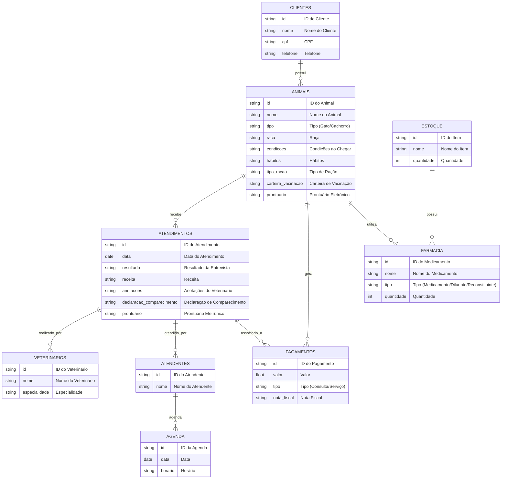
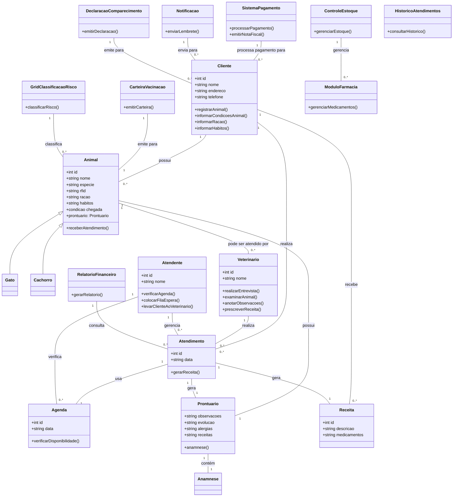
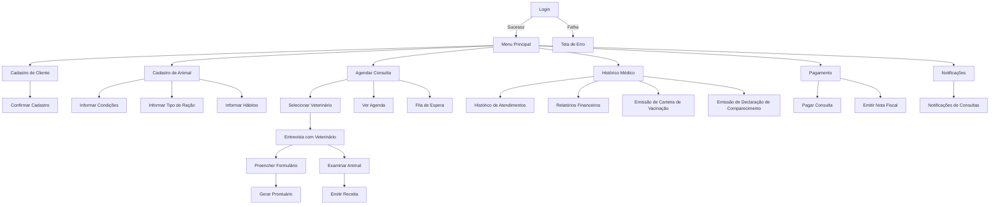

# **Repositório de Engenharia de Software - Sistema para PetShop**

Este repositório documenta o desenvolvimento de um sistema exclusivo para uma clínica veterinária especializada em gatos e cachorros. O objetivo é otimizar o gerenciamento de consultas, prontuários, estoque e outros serviços essenciais para o atendimento animal.

## **Índice**

1. [Visão Geral do Problema](#1-visão-geral-do-problema)
2. [Descrição do Negócio](#2-descrição-do-negócio)
3. [Visão Geral do Sistema](#3-visão-geral-do-sistema)
4. [Diagrama ER](#4-diagrama-er)
5. [Diagrama de Classe](#5-diagrama-de-classe)
6. [Casos de Uso](#6-casos-de-uso)  
   - [6.1 Casos de Uso](#61-casos-de-uso)  
   - [6.2 História de Usuário](#62-história-de-usuário)
7. [Diagrama de Componentes](#7-diagrama-de-componentes)
8. [Diagrama de Implantação](#8-diagrama-de-implantação)
9. [Protótipo de Telas](#9-protótipo-de-telas)
10. [Diagrama de Navegação de Telas](#10-diagrama-de-navegação-de-telas)
11. [Pilha Tecnológica](#11-pilha-tecnologica)
12. [Requisitos de Sistema](#12-requisitos-de-sistema)
13. [Considerações sobre Segurança](#13-consideraçôes-sobre-segurança)
14. [Manutenção e Instalação](#14-manutenção-e-instalação)
15. [Glossário](#15-glossário)
16. [Script SQL](#16-script-sql)  
    - [16.1 Comandos CREATE Table](#161-comandos-create-table)  
    - [16.2 Comandos INSERT Table](#162-comandos-insert-table)


# **1. Visão Geral do Problema**

O sistema é projetado para atender uma clínica veterinária de pequeno porte especializada em gatos e cachorros. O mercado não oferece soluções que atendam às necessidades específicas do negócio, e por isso, foi decidido o desenvolvimento de uma plataforma própria.


# 2. Descrição do negócio

Descrição do cenário onde o sistema deverá funcionar:

# **🐾 Principais Funcionalidades do Sistema 🐾**

> Abaixo estão listadas as principais funcionalidades e recursos do sistema desenvolvido para o gerenciamento completo de uma clínica veterinária especializada em gatos e cachorros.


1. Marcar animais com RFID
2. Uma clínica veterinária atende apenas os animais: gatos e cachorros.
3. Os clientes devem fazer um cadastro de si e dos animais.
4. Os clientes devem informar as condições nas quais os animais chegam.
5. Os clientes devem informar o tipo de ração que o animal come.
6. O cliente deve informar hábitos do animal.
7. Para cada animal é possível que mais de um veterinário o atenda.
8. Os animais podem chegar e serem atendidos de acordo com uma agenda do dia.
9. Cada animal atendido receberá uma ficha e um prontuário.
10. Outros dono podem querer marcar horários de atendimento futuro.
11. O atendimento gera uma receita para o animal.
12. Quando um cliente chega na clínica veterinária ele é atendido por um atendente.
13. O atendente deve verificar se existe agenda disponível com um veterinário.
14. O atendente deve colocar o cliente e seu animal na fila de espera, se for o caso.
15. O atendente deve levar o cliente e o animal até o veterinário.
16. O veterinário deve realizar uma entrevista com o dono do animal.
17. O resultado da entrevista deve ir para um formulário.
18. O veterinário deverá examinar o animal e anotar em prontuário(ficha) suas observações.
19. Dependendo da situação do animal este receberá uma receita.
20. Integração com sistemas de pagamento: o sistema deve permitir que os clientes paguem consultas e serviços diretamente na plataforma, com a possibilidade de emitir notas fiscais eletrônicas.
21. Notificações automáticas: o sistema deve enviar lembretes automáticos para os clientes sobre consultas agendadas.
22. Histórico médico completo do animal: o sistema deve permitir o acompanhamento detalhado do histórico de saúde, vacinas, exames, cirurgias e medicações do animal.
23. Relatórios financeiros.
24. Controle de estoque de itens cirurgicos.
25. Emissão de carteira de vacinação.
26. Emissão de declaração de comparecimento para tutores.
27. Prontuario eletronico com anamnese, recituario, evolução e alergias.
28. Grid com classificação de risco dos pets internados.
29. Histórico de atendimentos.
30. Módulo de farmacia, constando medicamentos, diluentes e reconstituintes presentes na clínica.

# 3. Visão geral do sistema

# 4. Diagrama ER

```mermaid
erDiagram
    CLIENTES {
        string id "ID do Cliente"
        string nome "Nome do Cliente"
        string cpf "CPF"
        string telefone "Telefone"
    }


    ANIMAIS {
        string id "ID do Animal"
        string nome "Nome do Animal"
        string tipo "Tipo (Gato/Cachorro)"
        string raca "Raça"
        string condicoes "Condições ao Chegar"
        string habitos "Hábitos"
        string tipo_racao "Tipo de Ração"
        string carteira_vacinacao "Carteira de Vacinação"
        string prontuario "Prontuário Eletrônico"
    }

    VETERINARIOS {
        string id "ID do Veterinário"
        string nome "Nome do Veterinário"
        string especialidade "Especialidade"
    }

    ATENDENTES {
        string id "ID do Atendente"
        string nome "Nome do Atendente"
    }

    ATENDIMENTOS {
        string id "ID do Atendimento"
        date data "Data do Atendimento"
        string resultado "Resultado da Entrevista"
        string receita "Receita"
        string anotacoes "Anotações do Veterinário"
        string declaracao_comparecimento "Declaração de Comparecimento"
        string prontuario "Prontuário Eletrônico"
    }

    AGENDA {
        string id "ID da Agenda"
        date data "Data"
        string horario "Horário"
    }

    PAGAMENTOS {
        string id "ID do Pagamento"
        float valor "Valor"
        string tipo "Tipo (Consulta/Serviço)"
        string nota_fiscal "Nota Fiscal"
    }

    ESTOQUE {
        string id "ID do Item"
        string nome "Nome do Item"
        int quantidade "Quantidade"
    }

    FARMACIA {
        string id "ID do Medicamento"
        string nome "Nome do Medicamento"
        string tipo "Tipo (Medicamento/Diluente/Reconstituinte)"
        int quantidade "Quantidade"
    }

    CLIENTES ||--o{ ANIMAIS : possui
    ANIMAIS ||--o{ ATENDIMENTOS : recebe
    ATENDIMENTOS ||--o{ VETERINARIOS : realizado_por
    ATENDIMENTOS ||--o{ ATENDENTES : atendido_por
    ATENDENTES ||--o{ AGENDA : agenda
    ANIMAIS ||--o{ PAGAMENTOS : gera
    ESTOQUE ||--o{ FARMACIA : possui
    ANIMAIS ||--o{ FARMACIA : utiliza
    ATENDIMENTOS ||--o{ PAGAMENTOS : associado_a
```

# 5. Diagrama de classe

```mermaid
classDiagram
    %% Classes principais
    class Cliente {
        +int id
        +string nome
        +string endereco
        +string telefone
        +registrarAnimal()
        +informarCondicoesAnimal()
        +informarRacao()
        +informarHabitos()
    }

    class Animal {
        +int id
        +string nome
        +string especie
        +string rfid
        +string racao
        +string habitos
        +condicao chegada
        +prontuario: Prontuario
        +receberAtendimento()
    }

    class Gato {
    }

    class Cachorro {
    }

    class Veterinario {
        +int id
        +string nome
        +realizarEntrevista()
        +examinarAnimal()
        +anotarObservacoes()
        +prescreverReceita()
    }

    class Atendente {
        +int id
        +string nome
        +verificarAgenda()
        +colocarFilaEspera()
        +levarClienteAoVeterinario()
    }

    class Agenda {
        +int id
        +string data
        +verificarDisponibilidade()
    }

    class Atendimento {
        +int id
        +string data
        +gerarReceita()
    }

    class Prontuario {
        +string observacoes
        +string evolucao
        +string alergias
        +string receitas
        +anamnese()
    }

    class Receita {
        +int id
        +string descricao
        +string medicamentos
    }

    class SistemaPagamento {
        +processarPagamento()
        +emitirNotaFiscal()
    }

    class Notificacao {
        +enviarLembrete()
    }

    class RelatorioFinanceiro {
        +gerarRelatorio()
    }

    class ControleEstoque {
        +gerenciarEstoque()
    }

    class CarteiraVacinacao {
        +emitirCarteira()
    }

    class DeclaracaoComparecimento {
        +emitirDeclaracao()
    }

    class GridClassificacaoRisco {
        +classificarRisco()
    }

    class ModuloFarmacia {
        +gerenciarMedicamentos()
    }

    class HistoricoAtendimentos {
        +consultarHistorico()
    }

    %% Relações
    Cliente "1" -- "0..*" Animal : possui
    Cliente "1" -- "0..*" Atendimento : realiza
    Cliente "1" -- "0..*" Receita : recebe

    Animal "1" -- "1" Prontuario : possui
    Animal "1" -- "0..*" Veterinario : pode ser atendido por
    Animal <|-- Gato
    Animal <|-- Cachorro

    Veterinario "1" -- "0..*" Atendimento : realiza

    Atendimento "1" -- "1" Prontuario : gera
    Atendimento "1" -- "1" Receita : gera
    Atendimento "1" -- "1" Agenda : usa

    Atendente "1" -- "0..*" Atendimento : gerencia
    Atendente "1" -- "0..*" Agenda : verifica

    Prontuario "1" -- "1" Anamnese : contém

    SistemaPagamento "1" -- "0..*" Cliente : processa pagamento para

    Notificacao "1" -- "0..*" Cliente : envia para

    RelatorioFinanceiro "1" -- "0..*" Atendimento : consulta

    ControleEstoque "1" -- "0..*" ModuloFarmacia : gerencia

    CarteiraVacinacao "1" -- "1" Animal : emite para

    DeclaracaoComparecimento "1" -- "0..*" Cliente : emite para

    GridClassificacaoRisco "1" -- "0..*" Animal : classifica

```
# 6. Casos de uso
  ## 6.1 Casos de uso


  ## 6.2 História de usuário
### 1. Marcar animais com RFID
**Como** um atendente,  
**Eu quero** marcar cada animal com um código RFID,  
**Para que** possamos rastrear e identificar os animais de forma eficiente.

### 2. Atender apenas gatos e cachorros
**Como** um gerente de clínica veterinária,  
**Eu quero** garantir que a clínica atenda apenas gatos e cachorros,  
**Para que** possamos especializar nossos serviços nesses tipos de animais.

### 3. Cadastro de clientes e animais
**Como** um cliente,  
**Eu quero** cadastrar minhas informações pessoais e as informações do meu animal,  
**Para que** o veterinário tenha todos os dados necessários para o atendimento.

### 4. Informar condições do animal
**Como** um cliente,  
**Eu quero** informar as condições nas quais o meu animal chegou à clínica,  
**Para que** o veterinário tenha um histórico preciso da condição de saúde do meu pet.

### 5. Informar tipo de ração do animal
**Como** um cliente,  
**Eu quero** informar o tipo de ração que meu animal come,  
**Para que** o veterinário tenha informações nutricionais relevantes.

### 6. Informar hábitos do animal
**Como** um cliente,  
**Eu quero** informar os hábitos do meu animal,  
**Para que** o veterinário possa considerar isso durante o diagnóstico e tratamento.

### 7. Atendimento por vários veterinários
**Como** um cliente,  
**Eu quero** que o meu animal possa ser atendido por mais de um veterinário,  
**Para que** ele receba cuidados de especialistas diferentes, conforme necessário.

### 8. Agendamento de consultas
**Como** um cliente,  
**Eu quero** que o meu animal seja atendido de acordo com uma agenda definida,  
**Para que** eu possa planejar o atendimento de forma eficiente.

### 9. Ficha e prontuário para cada animal
**Como** um veterinário,  
**Eu quero** criar uma ficha e um prontuário para cada animal atendido,  
**Para que** possamos registrar todas as informações relevantes sobre a saúde do animal.

### 10. Agendamento de consultas futuras
**Como** um cliente,  
**Eu quero** poder marcar horários de atendimento futuros,  
**Para que** eu garanta o atendimento em datas convenientes.

### 11. Receita gerada no atendimento
**Como** um veterinário,  
**Eu quero** gerar uma receita ao final de cada atendimento,  
**Para que** o cliente tenha as recomendações de medicamentos ou tratamentos necessários.

### 12. Atendimento inicial pelo atendente
**Como** um cliente,  
**Eu quero** ser atendido por um atendente quando eu chegar à clínica,  
**Para que** ele me oriente e inicie o processo de atendimento.

### 13. Verificação de agenda pelo atendente
**Como** um atendente,  
**Eu quero** verificar se existe uma agenda disponível para o veterinário,  
**Para que** eu possa organizar o atendimento do cliente e do animal.

### 14. Colocar cliente na fila de espera
**Como** um atendente,  
**Eu quero** colocar o cliente e seu animal na fila de espera,  
**Para que** eles sejam atendidos na ordem correta, se não houver agenda disponível.

### 15. Levar cliente ao veterinário
**Como** um atendente,  
**Eu quero** levar o cliente e seu animal até o veterinário,  
**Para que** eles possam iniciar a consulta.

### 16. Realizar entrevista com o dono
**Como** um veterinário,  
**Eu quero** realizar uma entrevista com o dono do animal,  
**Para que** eu tenha informações detalhadas para iniciar o exame.

### 17. Resultado da entrevista em formulário
**Como** um veterinário,  
**Eu quero** registrar o resultado da entrevista em um formulário,  
**Para que** as informações fiquem documentadas e disponíveis no prontuário.

### 18. Exame do animal e anotações no prontuário
**Como** um veterinário,  
**Eu quero** examinar o animal e anotar as observações no prontuário,  
**Para que** haja um registro completo do atendimento.

### 19. Receita para o animal
**Como** um veterinário,  
**Eu quero** prescrever uma receita para o animal,  
**Para que** ele receba os tratamentos ou medicamentos adequados.

### 20. Pagamento de consultas e serviços
**Como** um cliente,  
**Eu quero** pagar minhas consultas e serviços diretamente na plataforma,  
**Para que** eu tenha uma experiência integrada e simples, com a emissão de nota fiscal.

### 21. Notificações automáticas de lembrete
**Como** um cliente,  
**Eu quero** receber notificações automáticas de lembrete para consultas agendadas,  
**Para que** eu não perca o horário do atendimento.

### 22. Histórico médico completo do animal
**Como** um veterinário,  
**Eu quero** acompanhar o histórico médico completo do animal,  
**Para que** eu possa monitorar a saúde, vacinas, exames, cirurgias e medicações.

### 23. Relatórios financeiros
**Como** um gerente,  
**Eu quero** gerar relatórios financeiros detalhados,  
**Para que** eu possa acompanhar o desempenho financeiro da clínica.

### 24. Controle de estoque de itens cirúrgicos
**Como** um gerente,  
**Eu quero** gerenciar o estoque de itens cirúrgicos,  
**Para que** a clínica tenha sempre os materiais necessários para os procedimentos.

### 25. Emissão de carteira de vacinação
**Como** um veterinário,  
**Eu quero** emitir uma carteira de vacinação para o animal,  
**Para que** o dono tenha o controle das vacinas aplicadas.

### 26. Emissão de declaração de comparecimento
**Como** um atendente,  
**Eu quero** emitir uma declaração de comparecimento para os tutores,  
**Para que** eles possam justificar sua presença na clínica, se necessário.

### 27. Prontuário eletrônico completo
**Como** um veterinário,  
**Eu quero** registrar o prontuário eletrônico com anamnese, receitas, evolução e alergias,  
**Para que** o histórico de saúde do animal seja completo e acessível.

### 28. Grid de classificação de risco dos pets
**Como** um veterinário,  
**Eu quero** visualizar um grid com a classificação de risco dos pets internados,  
**Para que** possamos priorizar os cuidados de acordo com a urgência.

### 29. Histórico de atendimentos
**Como** um cliente,  
**Eu quero** acessar o histórico completo dos atendimentos do meu animal,  
**Para que** eu tenha um registro de todas as consultas e tratamentos.

### 30. Módulo de farmácia
**Como** um farmacêutico da clínica,  
**Eu quero** gerenciar os medicamentos, diluentes e reconstituintes presentes na clínica,  
**Para que** o estoque esteja sempre atualizado e os tratamentos sejam realizados sem interrupções.

# 7. Diagrama de componentes


# 8. Diagrama de implantação


# 9. Protótipo de telas


# 10. Diagrama de navegação de telas

```mermaid
graph TD;
    A[Login] -->|Sucesso| B[Menu Principal]
    A -->|Falha| C[Tela de Erro]

    B --> D[Cadastro de Cliente]
    B --> E[Cadastro de Animal]
    B --> F[Agendar Consulta]
    B --> G[Histórico Médico]
    B --> H[Pagamento]
    B --> I[Notificações]

    D --> J[Confirmar Cadastro]
    E --> K[Informar Condições]
    E --> L[Informar Tipo de Ração]
    E --> M[Informar Hábitos]
    F --> N[Selecionar Veterinário]
    F --> O[Ver Agenda]
    F --> P[Fila de Espera]

    N --> Q[Entrevista com Veterinário]
    Q --> R[Preencher Formulário]
    Q --> S[Examinar Animal]

    R --> T[Gerar Prontuário]
    S --> U[Emitir Receita]

    G --> V[Histórico de Atendimentos]
    G --> W[Relatórios Financeiros]
    G --> X[Emissão de Carteira de Vacinação]
    G --> Y[Emissão de Declaração de Comparecimento]

    H --> Z[Pagar Consulta]
    H --> AA[Emitir Nota Fiscal]

    I --> AB[Notificações de Consultas]
```

# 11. Pilha tecnologica

# 12. Requisitos de sistema

## 12.1 Requisitos do lado do cliente 
Os sistemas focados no lado do cliente são essenciais para a experiência do usuário em aplicações modernas. Eles lidam com a interface do usuário, a interação com os dados e a apresentação das informações, garantindo que a navegação seja intuitiva e responsiva. Neste documento, abordaremos os principais requisitos que devem ser considerados ao desenvolver sistemas com foco no lado do cliente.

### 1.1. Interface do Usuário
- **Design Responsivo**: Adaptar a interface a diferentes tamanhos de tela.
- **Navegação Intuitiva**: Facilitar o acesso às funcionalidades.

### 1.2. Autenticação
- **Login/Logout**: Permitir que usuários acessem suas contas.
- **Recuperação de Senha**: Facilitar a recuperação de senhas esquecidas.

### 1.3. Interação com Dados
- **Formulários Dinâmicos**: Permitir inserção e edição de dados pelo usuário.
- **Exibição de Dados**: Apresentar informações de forma clara e organizada.

### 1.4. Notificações
- **Alertas**: Informar usuários sobre atualizações ou ações necessárias.

### 2.1. Desempenho
- **Tempo de Carregamento**: A interface deve carregar rapidamente.
- **Responsividade**: As interações devem ser ágeis e fluidas.

### 2.2. Segurança
- **Criptografia de Dados**: Proteger informações sensíveis transmitidas.
- **Validação de Entrada**: Evitar injeção de dados maliciosos.

### 2.3. Acessibilidade
- **Compatibilidade com Leitores de Tela**: Garantir que o conteúdo seja acessível a usuários com deficiência.

## 12.2 Requisitos do lado do servidor 

Os sistemas focados no lado do servidor desempenham um papel crucial na arquitetura de aplicações modernas. Eles gerenciam a lógica de negócios, o armazenamento de dados e a comunicação entre o cliente e o servidor. Neste documento, abordaremos os principais requisitos que devem ser considerados ao desenvolver sistemas baseados em servidor.

### 1.1. Autenticação e Autorização
- **Registro de Usuários**: Permitir que novos usuários se registrem.
- **Login**: Sistema de autenticação para acesso a áreas restritas.
- **Controle de Acesso**: Definir permissões de usuários e papéis.

### 1.2. Manipulação de Dados
- **CRUD**: Implementação das operações de criar, ler, atualizar e deletar dados.
- **Validação de Dados**: Garantir que os dados recebidos atendam aos critérios definidos.

### 1.3. Processamento de Negócios
- **Regras de Negócio**: Implementar regras que governam o funcionamento do sistema.
- **Agendamento de Tarefas**: Permitir a execução de tarefas programadas.

### 2.1. Desempenho
- **Tempo de Resposta**: O sistema deve responder a solicitações em um tempo aceitável.
- **Escalabilidade**: O sistema deve ser capaz de suportar um aumento no número de usuários sem degradação de desempenho.

### 2.2. Segurança
- **Criptografia**: Proteger dados sensíveis em trânsito e em repouso.
- **Prevenção de Ataques**: Implementar medidas contra ataques comuns (ex: SQL Injection, XSS).

### 2.3. Manutenibilidade
- **Código Limpo e Documentado**: Manter o código legível e bem documentado para facilitar a manutenção.
- **Testes Automatizados**: Implementar testes para garantir a estabilidade do sistema durante atualizações.

### 2.4. Disponibilidade
- **Redundância**: Ter sistemas de backup e recuperação para garantir a continuidade do serviço.
- **Monitoramento**: Implementar ferramentas de monitoramento para identificar e corrigir falhas rapidamente.

# 13. Consideração sobre segurança

## 13.1. Lado cliente
Regras para login
    Captcha, quantidade minima de caracteres, caracteres especiais...
    Autenticação 2FA;
    Recuperação de senha com email; 

## 13.2 Lado servidor
Implementação de rotina de backup diario; 
1x na semana realizar um full backup;
O admin do sistema não pode acessar dados do cliente;

# 14. Manutenção e instalação

## 1. Instalação

### 1.1. Requisitos de Sistema
- **SO Suportados**: Windows, Linux e MacOS.
- **Conexão de Internet**: A aplicação requer uma conexão de internet estável.

### 1.2. Procedimento de Instalação
1. **Download do Pacote**: O usuário deve baixar o pacote da aplicação.
2. **Descompactação**: Extrair os arquivos em uma pasta de sua escolha.
3. **Acesso à Aplicação**: Abrir o executavel do sistema instalado no computador.

### 1.3. Configuração Inicial
- **Configurações de Usuário**: Permitir que o usuário configure suas preferências ao iniciar a aplicação pela primeira vez.

## 2. Funcionalidades

### 2.1. Interface do Usuário
- **Design Responsivo**: Adaptação automática a diferentes tamanhos de tela.
- **Navegação Intuitiva**: Estrutura clara e menus de fácil acesso.

### 2.2. Autenticação
- **Login e Registro**: Formulários para criação de conta e acesso ao sistema.
- **Recuperação de Senha**: Processo para redefinir senhas esquecidas.

### 2.3. Manipulação de Dados
- **CRUD**: Permitir aos usuários criar, ler, atualizar e deletar informações.
- **Validação de Dados**: Garantir que os dados inseridos atendam aos critérios estabelecidos.

### 2.4. Notificações
- **Alertas em Tempo Real**: Informar usuários sobre atualizações ou eventos importantes.

## 3. Manutenção

### 3.1. Atualizações de Sistema
- **Verificação de Versão**: O sistema deve checar automaticamente se há atualizações disponíveis.
- **Processo de Atualização**: Instruções claras sobre como atualizar a aplicação.

### 3.2. Suporte Técnico
- **Documentação de Ajuda**: Disponibilizar uma seção de FAQ e guias de uso.
- **Contato com Suporte**: Informações sobre como contatar a equipe de suporte.

### 3.3. Monitoramento e Feedback
- **Relatórios de Erros**: Permitir que usuários relatem problemas facilmente.
- **Coleta de Feedback**: Sistema para coletar sugestões e melhorias.

# 15. Glossário

# 16. Script SQL
## 16.1. Comandos CREATE table
```sql
-- Tabela ANIMAIS
CREATE TABLE ANIMAIS (
    id VARCHAR(50) PRIMARY KEY,
    nome VARCHAR(100) NOT NULL,
    tipo VARCHAR(50) NOT NULL, 
    raca VARCHAR(100),
    condicoes VARCHAR(255),
    habitos VARCHAR(255),
    tipo_racao VARCHAR(100),
    carteira_vacinacao VARCHAR(255),
    prontuario VARCHAR(255),
    cliente_id VARCHAR(50),
    FOREIGN KEY (cliente_id) REFERENCES CLIENTES(id) ON DELETE CASCADE
);

-- Tabela VETERINARIOS
CREATE TABLE VETERINARIOS (
    id VARCHAR(50) PRIMARY KEY,
    nome VARCHAR(100) NOT NULL,
    especialidade VARCHAR(100) 
);

-- Tabela ATENDENTES
CREATE TABLE ATENDENTES (
    id VARCHAR(50) PRIMARY KEY,
    nome VARCHAR(100) NOT NULL
);

-- Tabela ATENDIMENTOS
CREATE TABLE ATENDIMENTOS (
    id VARCHAR(50) PRIMARY KEY,
    data DATE NOT NULL,
    resultado VARCHAR(255),
    receita VARCHAR(255),
    anotacoes VARCHAR(255),
    declaracao_comparecimento VARCHAR(255),
    prontuario VARCHAR(255),
    animal_id VARCHAR(50),
    veterinario_id VARCHAR(50),
    atendente_id VARCHAR(50),
    FOREIGN KEY (animal_id) REFERENCES ANIMAIS(id) ON DELETE CASCADE,
    FOREIGN KEY (veterinario_id) REFERENCES VETERINARIOS(id) ON DELETE SET NULL,
    FOREIGN KEY (atendente_id) REFERENCES ATENDENTES(id) ON DELETE SET NULL
);

-- Tabela AGENDA
CREATE TABLE AGENDA (
    id VARCHAR(50) PRIMARY KEY,
    data DATE NOT NULL,
    horario VARCHAR(5),
    atendente_id VARCHAR(50),
    FOREIGN KEY (atendente_id) REFERENCES ATENDENTES(id) ON DELETE CASCADE
);

-- Tabela PAGAMENTOS
CREATE TABLE PAGAMENTOS (
    id VARCHAR(50) PRIMARY KEY,
    valor FLOAT NOT NULL,
    tipo VARCHAR(50) NOT NULL,  
    nota_fiscal VARCHAR(255),
    animal_id VARCHAR(50),
    atendimento_id VARCHAR(50),
    FOREIGN KEY (animal_id) REFERENCES ANIMAIS(id) ON DELETE CASCADE,
    FOREIGN KEY (atendimento_id) REFERENCES ATENDIMENTOS(id) ON DELETE CASCADE
);

-- Tabela ESTOQUE
CREATE TABLE ESTOQUE (
    id VARCHAR(50) PRIMARY KEY,
    nome VARCHAR(100) NOT NULL,
    quantidade INT NOT NULL
);

-- Tabela FARMACIA
CREATE TABLE FARMACIA (
    id VARCHAR(50) PRIMARY KEY,
    nome VARCHAR(100) NOT NULL,
    tipo VARCHAR(50) NOT NULL,  
    quantidade INT NOT NULL,
    estoque_id VARCHAR(50),
    FOREIGN KEY (estoque_id) REFERENCES ESTOQUE(id) ON DELETE CASCADE
);
```

## 16.2. Comandos INSERT table

```sql
-- Populando a tabela CLIENTES
INSERT INTO CLIENTES (id, nome, cpf, telefone)
VALUES 
('C001', 'João Silva', '111.111.111-11', '11999999999'),
('C002', 'Maria Souza', '222.222.222-22', '11988888888'),
('C003', 'Carlos Lima', '333.333.333-33', '11977777777'),
('C004', 'Ana Oliveira', '444.444.444-44', '11966666666'),
('C005', 'Lucas Costa', '555.555.555-55', '11955555555'),
('C006', 'Paula Ferreira', '666.666.666-66', '11944444444'),
('C007', 'Marcos Pereira', '777.777.777-77', '11933333333'),
('C008', 'Fernanda Alves', '888.888.888-88', '11922222222'),
('C009', 'Ricardo Gomes', '999.999.999-99', '11911111111'),
('C010', 'Julia Martins', '101.010.101-01', '11900000000');

-- Populando a tabela ANIMAIS
INSERT INTO ANIMAIS (id, nome, tipo, raca, condicoes, habitos, tipo_racao, carteira_vacinacao, prontuario, cliente_id)
VALUES 
('A001', 'Rex', 'Cachorro', 'Pastor Alemão', 'Ferido na pata', 'Muito ativo', 'Ração Premium', 'Vacinas em dia', 'Sem alergias', 'C001'),
('A002', 'Mia', 'Gato', 'Siamês', 'Febre', 'Dorminhoca', 'Ração Light', 'Vacinas em dia', 'Alergia a frango', 'C002'),
('A003', 'Thor', 'Cachorro', 'Labrador', 'Desidratado', 'Adora brincar', 'Ração Standard', 'Vacinas atrasadas', 'Sem alergias', 'C003'),
('A004', 'Bella', 'Gato', 'Persa', 'Infecção ocular', 'Calma', 'Ração Premium', 'Vacinas em dia', 'Sem alergias', 'C004'),
('A005', 'Max', 'Cachorro', 'Bulldog', 'Problema respiratório', 'Preguiçoso', 'Ração Especial', 'Vacinas em dia', 'Alergia a glúten', 'C005'),
('A006', 'Luna', 'Gato', 'Angorá', 'Vômito', 'Muito ativa', 'Ração Light', 'Vacinas em dia', 'Alergia a carne bovina', 'C006'),
('A007', 'Toby', 'Cachorro', 'Beagle', 'Pulgas', 'Curioso', 'Ração Premium', 'Vacinas em dia', 'Sem alergias', 'C007'),
('A008', 'Nina', 'Gato', 'Maine Coon', 'Problema renal', 'Muito tranquila', 'Ração Especial', 'Vacinas atrasadas', 'Sem alergias', 'C008'),
('A009', 'Simba', 'Cachorro', 'Golden Retriever', 'Infecção no ouvido', 'Adora correr', 'Ração Standard', 'Vacinas em dia', 'Sem alergias', 'C009'),
('A010', 'Chloe', 'Gato', 'Ragdoll', 'Alergia na pele', 'Muito carinhosa', 'Ração Premium', 'Vacinas em dia', 'Alergia a peixes', 'C010');

-- Populando a tabela VETERINARIOS
INSERT INTO VETERINARIOS (id, nome, especialidade)
VALUES 
('V001', 'Dr. Fernando', 'Clínica Geral'),
('V002', 'Dr. Camila', 'Dermatologia'),
('V003', 'Dr. Pedro', 'Cardiologia'),
('V004', 'Dra. Ana', 'Ortopedia'),
('V005', 'Dr. Lucas', 'Endocrinologia'),
('V006', 'Dra. Paula', 'Neurologia'),
('V007', 'Dr. João', 'Oftalmologia'),
('V008', 'Dra. Mariana', 'Oncologia'),
('V009', 'Dr. Roberto', 'Nefrologia'),
('V010', 'Dra. Clara', 'Gastroenterologia');

-- Populando a tabela ATENDENTES
INSERT INTO ATENDENTES (id, nome)
VALUES 
('AT001', 'Alice'),
('AT002', 'Bruno'),
('AT003', 'Carla'),
('AT004', 'Diego'),
('AT005', 'Elisa'),
('AT006', 'Felipe'),
('AT007', 'Gabriela'),
('AT008', 'Hugo'),
('AT009', 'Isabela'),
('AT010', 'João');

-- Populando a tabela ATENDIMENTOS
INSERT INTO ATENDIMENTOS (id, data, resultado, receita, anotacoes, declaracao_comparecimento, prontuario, animal_id, veterinario_id, atendente_id)
VALUES 
('ATD001', '2024-09-01', 'Exame físico completo', 'Antibiótico', 'Animal estável', 'Declaração entregue', 'Sem novos sintomas', 'A001', 'V001', 'AT001'),
('ATD002', '2024-09-02', 'Consulta de rotina', 'Ração especial', 'Alergia controlada', 'Declaração entregue', 'Animal em tratamento', 'A002', 'V002', 'AT002'),
('ATD003', '2024-09-03', 'Tratamento de desidratação', 'Soro fisiológico', 'Animal se recuperando', 'Declaração entregue', 'Sem novos sintomas', 'A003', 'V003', 'AT003'),
('ATD004', '2024-09-04', 'Infecção ocular tratada', 'Colírio', 'Animal estável', 'Declaração entregue', 'Sem novos sintomas', 'A004', 'V004', 'AT004'),
('ATD005', '2024-09-05', 'Problema respiratório', 'Broncodilatador', 'Animal com dificuldade respiratória', 'Declaração entregue', 'Monitoramento contínuo', 'A005', 'V005', 'AT005'),
('ATD006', '2024-09-06', 'Vômito persistente', 'Antiemético', 'Animal em observação', 'Declaração entregue', 'Sem novos sintomas', 'A006', 'V006', 'AT006'),
('ATD007', '2024-09-07', 'Tratamento de pulgas', 'Antipulgas', 'Animal estável', 'Declaração entregue', 'Sem novos sintomas', 'A007', 'V007', 'AT007'),
('ATD008', '2024-09-08', 'Problema renal tratado', 'Medicamento renal', 'Animal estável', 'Declaração entregue', 'Animal em recuperação', 'A008', 'V008', 'AT008'),
('ATD009', '2024-09-09', 'Infecção no ouvido', 'Antibiótico', 'Animal estável', 'Declaração entregue', 'Animal se recuperando', 'A009', 'V009', 'AT009'),
('ATD010', '2024-09-10', 'Alergia tratada', 'Corticosteroide', 'Animal sem sintomas', 'Declaração entregue', 'Monitoramento contínuo', 'A010', 'V010', 'AT010');

-- Populando a tabela AGENDA
INSERT INTO AGENDA (id, data, horario, atendente_id)
VALUES 
('AG001', '2024-09-01', '09:00', 'AT001'),
('AG002', '2024-09-02', '10:00', 'AT002'),
('AG003', '2024-09-03', '11:00', 'AT003'),
('AG004', '2024-09-04', '12:00', 'AT004'),
('AG005', '2024-09-05', '13:00', 'AT005'),
('AG006', '2024-09-06', '14:00', 'AT006'),
('AG007', '2024-09-07', '15:00', 'AT007'),
('AG008', '2024-09-08', '16:00', 'AT008'),
('AG009', '2024-09-09', '17:00', 'AT009'),
('AG010', '2024-09-10', '18:00', 'AT010');

-- Populando a tabela PAGAMENTOS
INSERT INTO PAGAMENTOS (id, valor, tipo, nota_fiscal, animal_id, atendimento_id)
VALUES 
('PAG001', 150.00, 'Consulta', 'NF001', 'A001', 'ATD001'),
('PAG002', 200.00, 'Serviço', 'NF002', 'A002', 'ATD002'),
('PAG003', 180.00, 'Consulta', 'NF003', 'A003', 'ATD003'),
```
